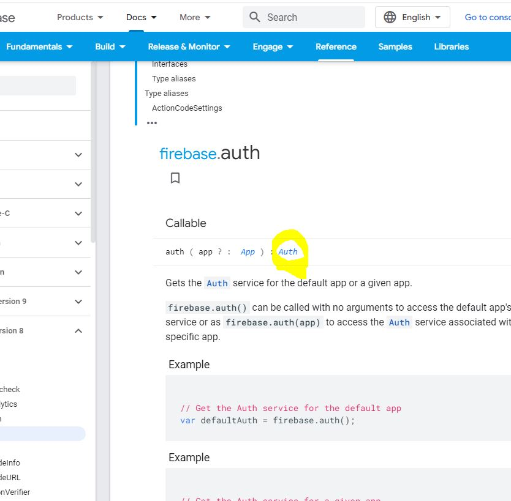

# Auth 사용하기

이제 유저의 로그인을 위한 Authentication(인증)에 관련된 기능을 만들건데,

firebase공식문서에서 찾아보면 된다.

내용이 많아서 찾기어려운데, docs > reference에서 js v8을 보면 대부분있다.

https://firebase.google.com/docs/reference/js/v8/firebase.authh

firebase.auth 모듈을 사용하려면, 가장먼저 해야할것은 import이다. 잊지말자

## 0.1 import

```js
//firebase.js
//기본버전
import "firebase/auth";

//업데이트 이전 버전사용
import "firebase/compat/auth";
```

그리고 당연히 이 모듈을 사용할 파일에서도 firebase파일 전체를 import해준다.

```js
//App.js
import firebase from "../firebase"

```
## 0.2 auth 기본코드수정

사용법의 가장 윗부분을 보면
함수처럼 호출해주라고 나온다.

```js
firebase.auth()
```
이렇게 호출하면 인증기능을 제공한다고 한다.
하지만 이 기능을 여러번쓸건데 매번이렇게 호출할 수 없으니,

firebase.js에서 약간 수정을 해주자.

```js
//firebase.js > 이름을 fbase.js로 수정했다.

//수정전 가장마지막줄
export default firebase.initializeApp(firebaseConfig);

//수정 후 > 두줄로 수정

firebase.initializeApp(firebaseConfig);

export const authService = firebase.auth();

```

[ 수정한 버전으로 import하기 ]
```js
//App.js
//수정 전
import fbase from "../fbase";

//수정 후
import { authService } from "../fbase";
```

## 0.3 auth는 뭘 받아오는가?

공식문서의 이부분을 클릭하여, auth는 뭘 받아오는지 알아보자.



property들과 method가 보이는데,

지금 우리가 해야할것은 유저의 로그인 여부를 판단하는것!

=> Properties의 currentUser를 하면된다.

## 0.4 currentUser

App.js에서 console에 찍어보았다.
로그인이 되어있다면, user값이

안되어있다면 null이 나온다.

```js
//App.js
 console.log(authService.currentUser);

 //null 출력
```

이 값을 isLoggenIn의 State값으로 준다.
```js
//App.js
 const [isLoggenIn, setIsLoggedIn] = useState(authService.currentUser);
```