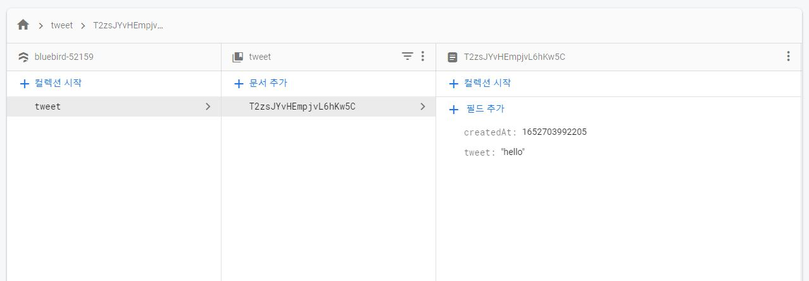

# Database
firebase에서 제공하는 Database를 사용해보자.
이 database는 NoSQL database이다.

규칙이 별로 없어 유연하고, 사용하기 쉽지만,
그 만큼 제약이 많다.

먼저 Cloud Firestore로 간다.

(firebase사이트의 go to console > 빌드)

## 0.1 database 생성하기
Cloud Firestore에서 생성하기를 클릭한다.

창이 하나뜨는데, production / test mode를 고를 수 있다.

test mode를 고른다.

지역은 asia~ 로 고르면된다.(나는 asia-northeast3)

## 0.2 import

firebase.js(fbase.js)에 import를 시켜야한다.

잊지말자 새로운 모듈사용하려면 import해야한다.

그리고 export를 추가한다.

```js
//fbase.js
//뉴버전
import "firebase/firestore";
export const dbService = firebase.firestore();
//구버전 사용
import "firebase/compat/firestore";
export const dbService = firebase.firestore();
```

## 0.3 NoSQL 특징
다시 firebase로 돌아와서,
NoSQL의 특징을 먼저 알아보자면

1. Collection과 Document를 가지고 있다.

ㄴ Collection: 기본적으로 폴더와 같다.

   Document : doc 문서같은 텍스트문서이다.

2. 하나의 database는 collection들을 갖고 있고,

각 collection은 Document를 가지고 있다.
다시말해 콜렉션은 다큐멘트의 그룹이다.

그럼 이제 Cloud Firestore에서 컬렉션시작(start collection)을 눌러보자.

원하는 id를 주고(tweet),필드와 값을 적으면 생성이 된다. 


=> 하지만 우리는 여기서 컬렉션을 만드는게아닌, 코드로 collection을 만들것이다.


## 0.4 우리가 해야할것은?
유저가 글을 작성하고, submit(tweet)을 누를때마다,

document를 생성하는 것이다.

firestore 공식문서를 참고해보자.

(https://firebase.google.com/docs/reference/js/v8/firebase.firestore?authuser=0)

firestore가 사용할 수 있는 매서드들중에 collection을 살펴보면, 

collection에는 collection경로(path)라는 걸 줘야한다.

submit버튼을 누를때마다 발생할것이니,
submit 함수에 추가해준다.

```js
//Home.js
const onSubmit = (e) => {
        e.preventDefault();
        dbService.collection("tweets").add()
    }

```
괄호안에 경로를 주고, .(온점)을 찍어보면 그다음 할수 있는 것들이 많이 나오는데, 우린 새로운 document를 만들어야하니 add를 사용해야한다.

## 0.5 add 작성

이 add 사용법을 보면, 데이터를 받는다.

어떤것이든 우리가 주고싶은 데이터를 넣을 수 있다.


```js
//Home.js
const [ tweet, setTweet ] = useState("");
const onSubmit = (e) => {
        e.preventDefault();
        dbService.collection("tweets").add({
         tweet:tweet,
         createdAt : Date.now(),
        });
         setTweet("")//비우기
    };
```

tweet은 key가 될것이고, state의 tweet과도 같다.

현재시간과 날짜를 받고, ,add한다음

setTweet("")로 비워준다.


## 0.6 확인하기

input창에 hello를 치고 tweet버튼을 눌렀다.

input창을 바로 지워지고,
Cloud Firestore에 접속해보니,

tweet컬렉션과 랜덤아이디, 그리고 작성한 hello가 저장되어있다.



