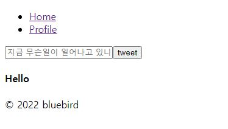
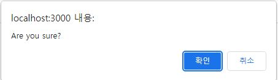

# Delete
트윗을 올렸다면, 삭제하거나 업데이트하는 경우도 생길 것이다.

이번엔 삭제방법을 알아보자.

먼저 아무것도 없는 곳에

[ 현재상태 ]

Hello라고 하나의 글을 입력했다.



## 0.1 새 컴포넌트 만들기

components 폴더에 새 컴포넌트를 만들어준다.

기존에 트윗을 Home에서 받아오고 있었는데,

트윗부분을 따로 만들어줄것이다.

(참고로 userObj는 현재저장된 유저의 정보)

```js
//src/components/Tweets.js
import React from 'react';

const Tweet = ({ userObj }) => {
    return (
     <div>
         <h4>{userObj.text}</h4>
     </div>
    );
};

export default Tweet;

```
이제 Home의 트윗 map부분을 삭제하고, Tweet컴포넌트를 랜더링하자.

```js
//Home.js
//수정 전
   <div>
          {getTweet.map(tweet => <div key={tweet.id}>
              <h4>{tweet.text}</h4>
          </div>)}
      </div>

//수정 후 
      <div>
          {getTweet.map((tweet) => (
          <Tweet key={tweet.id} userObj={tweet} /> 
          ))}
      </div>
```

여기까지하고 에러가 없다면, 기본틀은 완성

## 0.2 버튼 만들기 / prop 전달
Tweet에 삭제, 수정버튼을 만들어준다.

```js
//Tweet.js
const Tweet = ({ userObj }) => {
  return (
    <div>
      <h4>{userObj.text}</h4>
      <button>Delete</button>
      <button>Edit</button>
    </div>
  );
};
```

이제 삭제를 만들건데, 그전에 우리는 트윗작성자의 createdId를 가졌었다.

Home이 userObj을 받고있기때문에 Home으로가서
새 prop을 넘겨준다.

새 prop은 불린값을 갖게될건데,

```
isOwner={tweet.createdId === userObj.uid}
```

※ 트윗을 올릴때 발생하는 createdId와, 지금 로그인되어있는
유저의 id가 같은지 확인하는 역할을 한다.

```js
//Home.js
  <div>
          {getTweet.map((tweet) => (
          <Tweet key={tweet.id} userObj={tweet} isOwner={tweet.createdId === userObj.uid} /> 
          ))}
      </div>
```

## 0.3 prop 받고, 버튼 수정
당연히 전달을 했다면, 받고

버튼부분을 수정해주었는데

true일때, 즉 내가 올렷고, 내가지금로그인되어있을때

= 내가 주인일때만 저 버튼들이 보여진다.


```js
//Tweet.js
const Tweet = ({ userObj, isOwner }) => {
  return (
    <div>
      <h4>{userObj.text}</h4>
      {isOwner && (
        <>
          <button>Delete</button>
          <button>Edit</button>
        </>
      )}
    </div>
  );
};

```
## 0.4 기능구현
트윗을 삭제하고, 수정하는 함수를 만들자.

먼저 삭제를 클릭하면 실행되는 삭제함수를 만들건데,

삭제는 중요하니 window.confirm을 사용해서 확인문구를 띄워주자.



그럼 삭제버튼을 누르면 이렇게 창이 뜨고, 유저의 값선택에따라 불린값을 받게된다.

```js
//삭제 구현
   const onDelete = () => {
        const ok = window.confirm("Are you sure?");
        if(ok){ //삭제
            dbService.doc(`tweet/${userObj.id}`).delete();;
        }
    };
```

delete매서드가 따로없어서, doc 문서를 보니 그안에 있었다.


doc() 괄호안에 경로를 적어준다.

트윗은 tweet이라는 document안에 있고,

id를 사용해 클릭된 트윗을 삭제할 것이다.
여기서 필요한 id는 prop으로받은 userObj에서 찾을 수 있다.

이렇게 작성하고, 다시 삭제버튼클릭 > 확인 누르면

삭제가 가능하다.

# Edit

그럼 이제 수정을 해보자.

## 0.1 state를 두개 만든다.

첫번째 state는 지금 수정중인지 확인하는 state로 기본값으로 false를 가지고있다.

두번째 state는 기본값으로 현재의 트윗내용을 담고있다.

```js
//Tweet.js
    const [ editing, setEditing ] = useState(false);
    const [ newOne, setNewOne ] = useState(userObj.text);
```

## 0.2 toggleEdit을 만든다.
```js
const toggleEdit = () => setEditing((prev)=> !prev);
```
toggleEdit은 위에서만든 state editing의 값에따라 edit버튼을 보여주고, 숨기고 할것이라 현재값의 반대의 값을 리턴한다.

## 0.3 toggleEdit 연결

editing이 true일때, 즉 수정중일때 

input창을 보여주고, value로 현재값을 가져오는것이다.
```js
//생략
return (
    <div>
      {editing ? (
        <form>
        <input type="text" placeholder="수정할 문구를 작성해주세요" value={newOne} required />
        </form>
      ) : (
        <>
          <h4>{userObj.text}</h4>
          {isOwner && (
            <>
              <button onClick={onDelete}>Delete</button>
              <button onClick={toggleEdit}>Edit</button>
            </>
          )}
        </>
      )}
    </div>
  );


```

여기에 cancle버튼을 하나더 추가하면, edit에서 다시 nonedit으로 갈수있다.
```js

 <button onClick={toggleEdit}>Cancle</button>
```

## 0.4 onChange
onChange가 없다면, 수정하면서 내가 수정하고있는 text를 볼수가 없다.

그래서 onchange를 만들어준다. 

그리고 input에 연결

```js
const onChange = (e) => {setNewOne(e.target.value);}

 <form>
          <input onChange={onChange} type="text" placeholder="수정할 문구를 작성해주세요" value={newOne} required />
        </form>
```

## 0.5 새로운 트윗을 Submit
수정을 완료했다면, 올려야하니 Submit input을 만들어준다.
(지금은 수정중에 cancle버튼만 보이는 상황)
```js

      <form>
          <input onChange={onChange} type="text" placeholder="수정할 문구를 작성해주세요" value={newOne} required />
          <input type="submit" value="Update" />
        </form>
```

그리고 form에 연결할 onSubmit만들기

기본적인 기능을 막는,      
e.preventDefault();를 넣고,

delete와 반대로 update()를 써준다.

중요한건, update안에 객체로, text를 
지금 수정한 state를 넣어준다.

```js
  const onSubmit = (e) => {
      e.preventDefault();
      dbService.doc(`tweet/${userObj.id}`).update({
          text : newOne,
      });
      setEditing(false);
    }

```