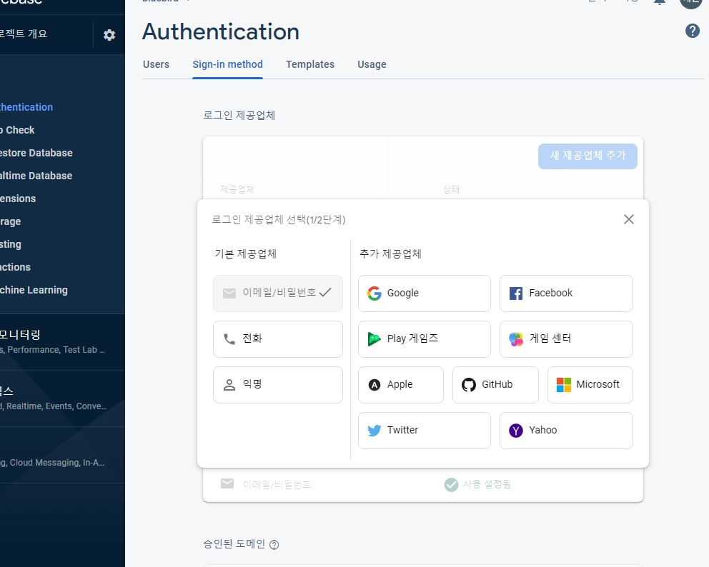

# 계정 만들기

firebase에 로그인 한 뒤, 왼쪽에 있는
go to consol로 가보자.

Develop(또는 빌드)의 Authentication에 들어가보면, 아무도 인증되어 있지 않는것을 확인할 수 있다.

시작하기 버튼을 누르면 어떤방식으로 로그인할 건지 선택지를 볼 수 있다.

## 0.1 로그인 방식 선택하기


원하는 방식을 일일이 선택하여, on으로 해줘야한다.

- github

github을 사용하려면, 설정을 해줘야하는데 

github페이지 > 내 프로필클릭 > setting > 왼쪽하단 Developer setting > 왼쪽 OAuth Apps > Resister~ >  어플이름쓰고, Homepage url은 firebase에 나오는 제일아래 url에서 com까지만 적고, callback url은 방금적은 url 전체 그대로.

그리고 Resister 누르면 ID와 비밀번호가 발급된다.

그 아이디와 비밀번호를 를 firebase client ID, SECRET에 넣어준다.


## 0.2 계정 만들기. 
첫번째로 이메일과, 패스워드를 받기위해
form과 input으로 기본 형태를 만들어주고,

이렇게 받은 값으로 계정을 생성해보자.

공식문서의 firebase.auth의 provider를 살펴보면,

https://firebase.google.com/docs/reference/js/v8/firebase.auth.AuthProvider?authuser=0

email auth provider가 있다.

첫번째 링크(firebase.auth.Auth.createUserWithEmailAndPassword)
를 들어가보면,

이메일과 패스워드로 유저만드는 방법이 나온다.

```js
//계정만드는방법 - 공식문서
createUserWithEmailAndPassword ( email :  string ,  password :  string ) : Promise < UserCredential >
```
그리고 두번째링크는 로그인하는 방법

signInWithEmailAndPassword을 사용한다.

```js
//Auth.js
//윗부분 생략
const onSubmit = async(e) => {
    e.preventDefault();
    try{
        let data;
    if(newAccount){//계정 만들기
    data = await authService.createUserWithEmailAndPassword(
        email,
        password
    );
    }else {//로그인
     data = await authService.signInWithEmailAndPassword(email,password);
    }
    console.log(data);
   }catch(error){
    console.log(error);
}
  };
```

promise 대신 async await사용해주고,

당연히, 계정생성이나, 로그인 둘다 email과 password를 받는다.

email과 password를 작성후 계정생성버튼을 누르면

콘솔창에 이런모습이 출력된다.
```
{
    "operationType": "signIn",
    "credential": null,
    "additionalUserInfo": {
        "isNewUser": true,
        "providerId": "password",
        "profile": {}
    },
    "user": {
        "uid": "GGXTTNTancSK29Ow6CYFm1JbFnp2",
        "email": "fdsfsdd@gmail.com",
        "emailVerified": false,
        "isAnonymous": false,
        "providerData": [
            {
                "providerId": "password",
                "uid": "fdsfsdd@gmail.com",
                "displayName": null,
                "email": "fdsfsdd@gmail.com",
                "phoneNumber": null,
                "photoURL": null
            }
        ],
     
    ..//생략
}
```
## 0.3 유저 확인하기
이게바로 로그인까지 된 상태이다.

firebase 사이트의 go to console을 누르고, 내가 만들고있는 프로젝트를 누르면 
Authentication에 처음과 다르게 등록된 user들이 보인다.

## 0.4 Persistance
유저들을 어떻게 기억할것인지 선택하는 것이다.

- local

초기값은 local이고, 
브라우저를 닫더라고 입력된 사용자 정보가 기억될것이라는 뜻이다.

- session

session이라는 type도 있는데, 이 타입은 브라우저가 열려있는동안만 사용자를 기억한다.

- none

유저를 기억하지 않는다. 로그인이 가능하지만
새로고침을 한다면 유저의 값이 다 없어진다.

유저의 값을 어디에 저장하냐면

개발자모드 > application > indexedDB > firebase..  > value

## 0.5 근데 왜 로그인이 안되는것인가?
로그인이 되었는데 왜 로그인이 필요한 페이지가 보이는가..?

firebase에서 로그인되기에는 약간의 시간이 필요한데
```js
//App.js
const [isLoggenIn, setIsLoggedIn] = useState(authService.currentUser);
```
 이 usestate가 기다리지않고, 로그인되기전 null상태를 받아와버린다.

=> 해결법

1. 
하나의 state를 또만들고
```js
  const [ init, setInit ] = useState(false);
```

2. useEffect로 firebase가 초기화된것을 확인하자.
```js
  useEffect(()=> {
authService.onAuthStateChanged((user) => console.log(user));
  },[]);
```

중요한건 useEffect로 어떻게 초기화된것을 확인하느냐

로그인 상태를 관찰하는 firebase의 onAuthStateChanged 매서드를 사용한다.

onAuthStateChanged는 유저가 로그인할때, 로그아웃할때 등 상태를 계속 관찰한다.

이렇게 작성하면, console창에 잠시 시간을 두고 출력이된다.

[ 코드 수정 ]
isLoggenIn의 초기값을 false로 수정하고,
useEffect안에서 if문을 사용하여 값을 바꾼다.
```js
  const [isLoggenIn, setIsLoggedIn] = useState(false);
   useEffect(()=> {
  authService.onAuthStateChanged((user) =>{
    if(user){
      setIsLoggedIn(true);
    }else {
      setIsLoggedIn(false);
    }
    setInit(true)
  });
    },[]);
```

## 0.6 화면수정

자 마지막으로 로그인이 되었다면 화면을 바꿔보자.

```js
  <input type="submit" value={newAccount ? "Create Account" :"Login"} />
```

## 0.7 에러출력하기

에러가 콘솔에만 보이니까 유저가 볼수있도록 해주자.

state를 만들고,
```js
 const [ error, setError ] =useState("");
```

catch(error)부분을 이렇게수정한다.

```js
catch(error){
    setError(error.message);
}
```

그리고 form이 끝나기 바로 전, 출력

{error}