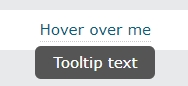
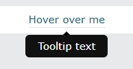

# CSS 툴팁

유저가 요소 위에 마우스를 가져갔을 때 추가정보를 지정하는데 사용된다.
https://www.w3schools.com/css/css_tooltip.asp

- 사용법

원하는 html 요소에"tooltip"이라는 클래스를 추가한다.

기본모양은 모서리가 둥근 사각형이며, 아래쪽 화살표 위쪽화살표 등 말풍선 모양이 가능하다.

```js
//기본 아래쪽 툴팁
.tooltip .tooltiptext {
  top: -5px;
  left: 105%;
}
```



화살표를 사용하려면 가상요소인 ::after를 사용한다.
```js
////화살표 아래쪽 툴팁
.tooltip .tooltiptext::after {
  content: " ";
  position: absolute;
  bottom: 100%;  /* At the top of the tooltip */
  left: 50%;
  margin-left: -5px;
  border-width: 5px;
  border-style: solid;
  border-color: transparent transparent black transparent;
}
```



```js
//페이드 인 툴팁(애니메이션)
.tooltip .tooltiptext {
  opacity: 0;
  transition: opacity 1s;
}

.tooltip:hover .tooltiptext {
  opacity: 1;
}
```

