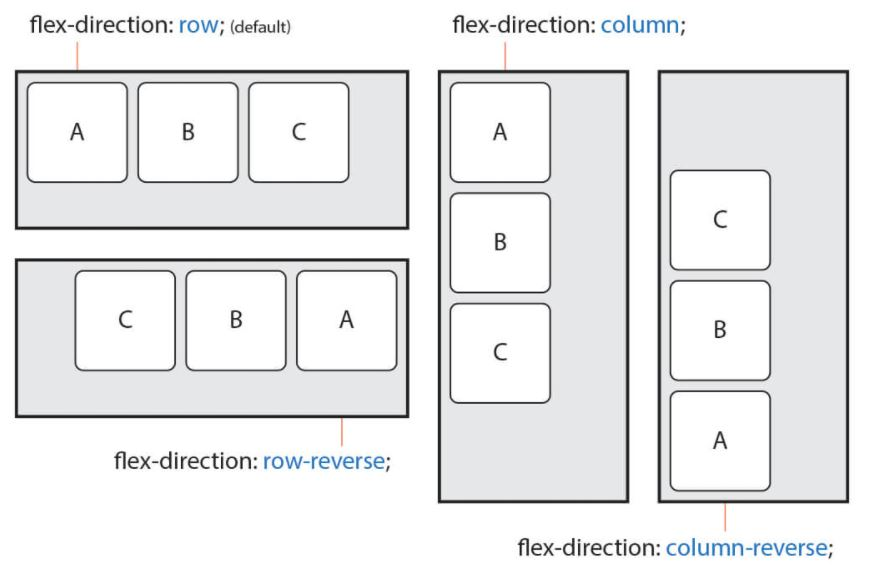

# flex 
flex는 레이아웃의 수평, 수직 정렬을 위해 사용된다.


[ 현재 상태 ]

예제) container안의 3개의 box정렬하기.
```html
<div class="container">
  <div class="box1"></div>
   <div class="box2"></div>
   <div class="box3"></div>
</div>
```

```css
.container {
 border : 2px solid #000;
}
.container div {
  width : 100px;
  height : 100px;
  border-radius:10px;
  border:2px solid yellowgreen;
}
```
[ 현재 상태 ]


모든 box들이 div이므로, 블록상태이다.
##  flex없이, 기존의 대체제들로 이 box를 정렬해보면?

- inline-block


box에 display inline-bolck을 하면
가로로 정렬되지만, 빈틈이 생긴다.

저 빈틈이 생기는 이유는 inline요소는 텍스트에 최적화되어있기 때문에, 저 div박스를 text로 인식하고 한칸씩 띄운것.

부모요소에 font-size : 0을 넣으면 빈칸이 없어진다.

- float: left

float는 기본적으로 띄우는 행위인데,

왼쪽으로 정렬시켜 띄운다는것이다.


하지만, 이렇게 부모가 자식을 감싸지 못해

부모에 따로 after 가상요소를 주어
자식요소들을 감싸는 것처럼 만들어야한다.

```css
.container::after{
  content:"";
  display : block;
  clear:both;
}
```

-------------------------
## **flex 기본 사용법**

이렇게 번거로운 대체제들 말고, 부모요소에 flex만 사용하면, 바로 정렬이된다.
```css
.container {
 border : 2px solid #000;
 display: flex;
}
```
  

## flex 
flex는 두개의 개념으로 나뉘는데, 
위의 예제와 같이
container와 그안에있는 items로 나뉜다.

무언가를 정렬하려면, 그것들을 감싸고있는 컨테이너가 필수로 있어야한다.

또 컨테이너와 아이템에 각각 사용할 수 있는 속성들이 다르다.

  


## flex container
container에 부여할 수 있는 속성들을 살펴보자.

- display : flex / inline-flex 값을 부여할 수 있다.

  둘의 차이점은 flex는 컨테이너자체를 블록요소로 인지
  
  

## flex-flow

flex-flow는 아래 두가지 속성을 한번에 사용가능하다.

- flex-direction : items의 x축, y축을 설정.
  
     (row / row-reverse / column / column-reverse )

     


- flex-wrap : items 여러줄 바꿈 설정

  (nowrap, wrap, wrap-reverse) 기본값은 무조건한줄
   


- justify-content : 주축(주로 x축)의 정렬방법을 설정한다. 

  justify-content : center로 가운데 정렬을 할 수 있다.
   


- align-content : 교차축(주로 y축)의 정렬방법을 설정한다. 


  align-content : center로 가운데 정렬을 할 수 있다.

  


  [이미지출처 https://heropy.blog/2018/11/24/css-flexible-box/]
