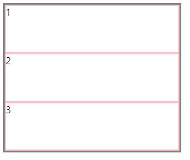

# grid
레이아웃을 더 다양하게 만들기위해 2차원(행,렬)의 grid를 사용한다.

grid도 flex와 동일하게 아이템들을 감싸는 컨테이너가 필요하고,

컨테이너에만, 아이템에만 사용할 수 있는 속성이 정해져있다.

## grid-container
컨테이너를 먼저 만들어야하는데

display: grid 또는 inline-grid로 만들 수 있다.
```html
<!-- html -->
<div class="container">
  <div class="item">1</div>
    <div class="item">2</div>
    <div class="item">3</div>
</div>
```

```css
/* css */
.container {
  display : grid;
  width:300px;
  height:250px;
  border : 3px solid gray;
}
.item{
   border : 2px solid pink;
}
```
[ 현재모습 ]



## 행과 열의 갯수 (grid-template-rows/columns)

 grid-template-columns은 열을 말하는데 만들고싶은 열의 갯수만큼 크기를 적는다.

 예)200px 2개를 만들고 싶으니 2번적는다.
 ``` css
 .container{
 grid-template-columns: 200px 200px;
 }
 ```

이렇게 내가 직접 열의 사이즈를 정해줄수도있고, 보여지는
컨테이너에 맞게 정하는 방법도 있다. >> fr

 1:1 비율로 만들겠다.
```css
 .container{
  grid-template-columns:1fr 1fr; 
  }
```
------------------------
여기서 점점더 갯수가 많아지면 하나씩 적는게아니라 repeat을 사용한다.
## repeat
```css
 .container{
    grid-template-columns: repeat(3, 1fr);
  }
```
1fr을 3번 반복하겠다.

