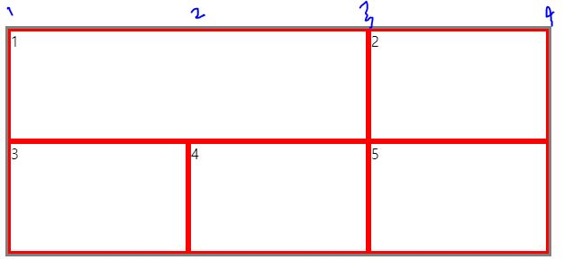
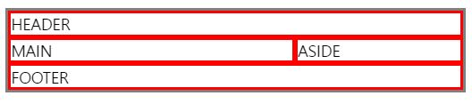

# grid
레이아웃을 더 다양하게 만들기위해 2차원(행,렬)의 grid를 사용한다.

grid도 flex와 동일하게 아이템들을 감싸는 컨테이너가 필요하고,

컨테이너에만, 아이템에만 사용할 수 있는 속성이 정해져있다.

## grid-container
컨테이너를 먼저 만들어야하는데

display: grid 또는 inline-grid로 만들 수 있다.
```html
<!-- html -->
<div class="container">
  <div class="item">1</div>
    <div class="item">2</div>
    <div class="item">3</div>
</div>
```

```css
/* css */
.container {
  display : grid;
  width:300px;
  height:250px;
  border : 3px solid gray;
}
.item{
   border : 2px solid pink;
}
```
[ 현재모습 ]


## 행과 열의 갯수 (grid-template-rows/columns)

 grid-template-columns은 열을 말하는데 만들고싶은 열의 갯수만큼 크기를 적는다.

 예)200px 2개를 만들고 싶으니 2번적는다.
 ``` css
 .container{
 grid-template-columns: 200px 200px;
 }
 ```

이렇게 내가 직접 열의 사이즈를 정해줄수도있고, 보여지는
컨테이너에 맞게 정하는 방법도 있다. >> fr

 1:1 비율로 만들겠다.
```css
 .container{
  grid-template-columns:1fr 1fr; 
  }
```
------------------------
여기서 점점더 갯수가 많아지면 하나씩 적는게아니라 repeat을 사용한다.
## repeat
```css
 .container{
    grid-template-columns: repeat(3, 1fr);
  }
```
1fr을 3번 반복하겠다.

## 아이템의 위치조정 (아이템에 속성주기)

파이어폭스 개발자모드로보면 더 쉽게 그리드를 확인할 수 있다.

왼쪽부터 오른쪽으로 1,2,3,4 시작되어 이렇게 1슬래시 3이라고쓰면
3까지 확장하겠다는 뜻이다.

행은 grid-column , 열은 grid-row로 사용이 가능하다.
```css
.container {
  display : grid;
  width:600px;
  height:250px;
  border : 3px solid gray;
  grid-template-columns: repeat(3, 1fr);
}
.item{
   border : 3px solid red
}
.item:first-child{
  grid-column:1/3;
}

```


## 참조해서 구성하기 (grid-template-areas)

각각의 구역(아이템)에 grid-area로 이름을 주고,
컨테이너에서 grid-template-areas지정

```html
<!-- //html -->
<div class="container">
  <div class="item">HEADER</div>
    <div class="item">MAIN</div>
    <div class="item">ASIDE</div>
  <div class="item">FOOTER</div>
</div>
```
```css
/* //css/ */
.container {
  display : grid;
  border : 3px solid gray;
  grid-template-areas:
   "header header header"
   "main main aside"
   "footer footer footer";
}
.item{
   border : 3px solid red
}
.item:nth-child(1){
  grid-area:header;
}
.item:nth-child(2){
  grid-area:main;
}
.item:nth-child(3){
  grid-area:aside;
}
.item:nth-child(4){
  grid-area:footer;
}

```
[ 현재모습 ]



만약 한칸을 비우고싶다면 이름대신 . 점을 찍어주면 그부분은 비워진다.

예시)가운데 main대신 .
```CSS
.container{
  grid-template-areas:
   "header header header"
   "main . aside"
   "footer footer footer";
}
``` 

## 간격 gap
row-gap, column-gap으로 각각의 간격을 줄 수 있고
gap(row의값, column의 값) 이렇게쓰면 한번에 둘다 사용이 가능하다.

예)
```css
.container{
   gap(15px, 30px);
}
```
