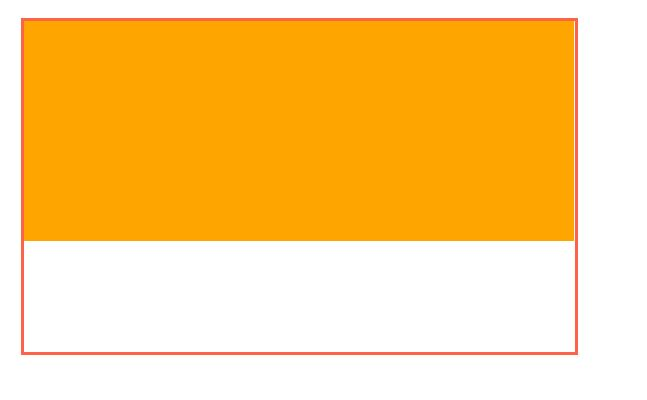
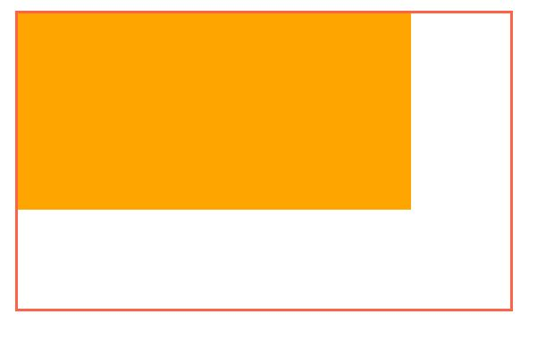
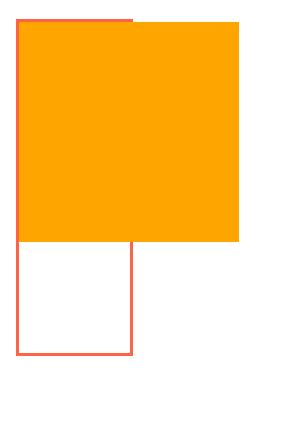

# min_max 

width와 heigth의 기본값 = auto(브라우저가 너비를 계산)

auto로 설정하면 

width는 기본값이 100%,
height는 0 이다.


## max-width, min-width, max-height, min-height

요소의 최대,최소 가로 너비를 지정한다.

이렇게 최대 가로길이와, 최소 가로길이를 지정하면

그 요소는 그 값보다 커질수/작아질 수 없다.

```html
<!-- html -->
<div class="parent">
  <div class="child"></div>
</div>
```
```css
/* css */
.parent {
  width : 500px;
  height: 300px;
  border: 3px solid tomato;
  margin: 20px;
}
.child {

  height: 200px;
  background : orange;
}
```
이렇게 코드를 작성하면, 부모박스안에 오렌지색의 child가 꽉차는 모습이 된다.

child의 따로 width값을 주지않았지만,

div는 블록요소이기 때문에 기본값이 100% 이다.



### 여기에 max-width 와 min-width를 추가해보자.

```css
/* css */
.parent {
  width : 500px;
  height: 300px;
  border: 3px solid tomato;
  margin: 20px;
}
.child {
  max-width : 400px;
  min-width : 200px;
  height: 200px;
  background : orange;
}
```
이렇게 작성하면, max-width 400px에 막혀서, 오렌지박스가 꽉차지 않는 것을 확인 할 수 있다.



반대로 parent의 부모값을, child의 최소값보다 줄이면

이번엔 min-width에 막혀, 오렌지박스가 부모보다 튀어나오는 모습이 된다.

```css
/* css */
.parent {
  width : 100px;
  height: 300px;
  border: 3px solid tomato;
  margin: 20px;
}
.child {
  max-width : 400px;
  min-width : 200px;
  height: 200px;
  background : orange;
}
```
