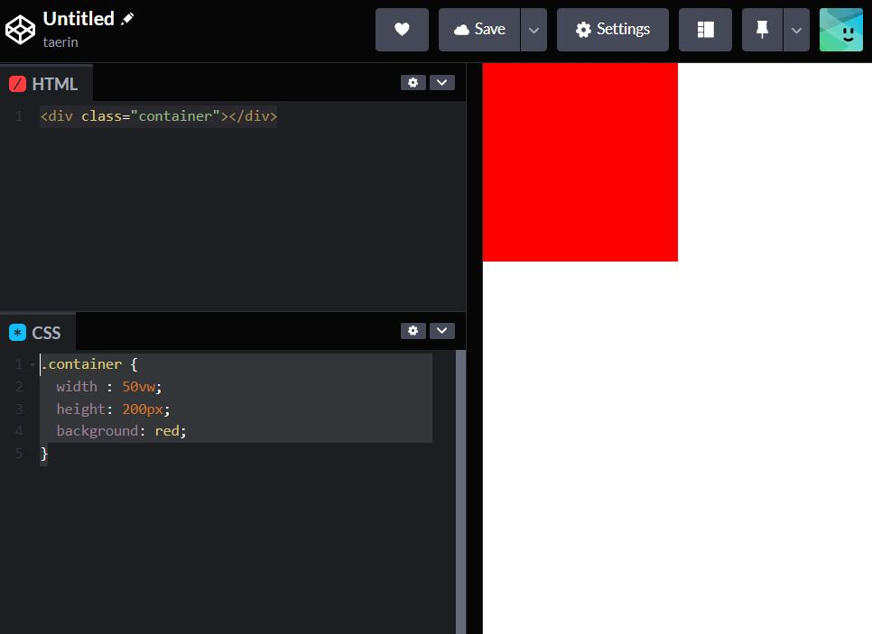

# 단위 
나는 웹디자이너이기 때문에 기본적으로 포토샵에서 익숙해진 px(픽셀)단위를 많이 쓴다.

하지만, 반응형을 만들거나 클론코딩을 하다보면 더 편리하고, 새로운 단위들이

많이보여 미루고미루다 드디어 정리를 해보았다.

## 1. px


px단위는 가장 기본적인 단위로 값이 고정되어있다고 보면된다.

부모요소나, 다른요소의 크기가 바뀌어도 해당요소에 준 사이즈 그대로 유지된다.


## 2. %

퍼센트는 부모요소의 영향을 받는다.

그렇기때문에 위 1번 픽셀에서의 모습처럼 만들어주려면,

부모의 값을 설정하고 그에 비례한 퍼센트 값을 넣어줘야한다.

//html은 동일

```css
/* css */
body * {
  border:2px solid
}
.container{
  width : 600px;
}
.parent{
  width : 50%;
}
.child{
  width : 50%;
}
```

## 3. em, rem
### em
em은 자기자신의 폰트크기의 영향을 받는다.

container에 폰트사이즈를 10px의 폰트사이즈를 주면,

[원래 사이즈 / 폰트사이즈] 600px / 10px 을해서 60em을 줘야한다.

parent와 child는 폰트사이즈가 따로 정의되지않았지만, 부모에게 상속을 받기때문에

em으로 작성이 가능하다.

```css
/* css */
body * {
  border:2px solid
}
.container{
  width : 60em;
  font-size : 10px;
}
.parent{
  width : 30em;
}
.child{
  width : 15em;
}
```

추가로 다른 폰트사이즈를 주면? 

parent에 em단위로 폰트사이즈를 정의.
```css
/* css */
body * {
  border:2px solid
}
.container{
  width : 60em;
  font-size : 10px;
}
.parent{
  width : 30em;
  font-size : 2em; /
}
.child{
  width : 15em;
  font-size : 2em;
}
```
이 말은 즉, 상속받은 폰트사이즈 10px의 2배 = 20px이라는 것이다.

child는 parent에서 상속받은 폰트사이즈(20px)의 2배


### 단점 - 계속해서 상속을 받기때문에 사이즈를 주려면 부모와 그 부모의 부모까지 정확한 사이즈를 알아야하고, 중간에 사이즈를 주기 애매하거나, 하나를 놓치는 경우가 생긴다

### => 그래서 rem 사용

### rem

가장 윗부분, 조상인 html에서 지정한 폰트사이즈에만 영향을 받는다.

child의 width를 200px로 만들기위해

rem에서는 html의 폰트사이즈가 10이므로 200/10 = 20rem을 해준다.

부모의 사이즈와는 전혀관련없다.

"html의 폰트사이즈를 바꾸면, 전체에서 폰트사이즈가 바뀌기때문에 그부분이 싫을경우,

바로 아래 body에 원래폰트사이즈를 다시 준다."
```css
html {
   font-size : 10px;
}
/*body{
  font-size: 16px;
} */
body * {
  border: 2px solid
}
.container{
  width : 60em;
  font-size : 10px;
}
.parent{
  width : 30em;
  font-size : 2em;
}
.child{
  width : 20rem;
  font-size : 2em;
}
```

## 4. vw, vh

vw는 viewport width의 줄임말로, 현재보이는 화면 가로값에 비례하고,

vh는 viewport height의 줄임말로, 현재보이는 화면의 세로값에 비례한다.

(viewport는 보이는 화면 전체)

```html
<!-- html/// -->
<div class="container"></div>
```

현재화면의 반, 50%의 넓이를 주려할때 (전체는100%)
```css
/* css */
.container {
  width : 50vw;
  height: 200px;
  background: red;
}
```


단위가 vw, 말그대로 보이는 화면에 비례한것이라 화면을 줄이거나, 넓혔을때 

그영역이 달라진다.

### [화면을 줄였을때 - 코드는 동일하다]



vh도 vw와 동일하게 사용한다.

가로, 세로 현재보이는 창의 절반설정

```css
/* css */
.container {
  width : 50vw;
  height: 50vh;
  background: red;
}
```
## 5. vmin, vmax


vmin은 viewport의 가로,세로 길이를 비교해 길이가 더 짧은쪽,

vmax은 길이가 더 긴쪽을 기준으로 비례한다.
```html
<!-- html/// -->
<div class="container"></div>
```
```css
/* css */
.container {
  width : 50vmax;
  height: 200px;
  background: red;
}
```
현재 내화면(뷰포트)은 가로가 훨씬길다. 그래서 50vmax는 가로길이의 절반을 나타낸다.


### 화면을 줄여 세로길이가 더 길게 만들면,


빨간 상자의 가로사이즈는, 뷰포트 세로길이의 절반이다.