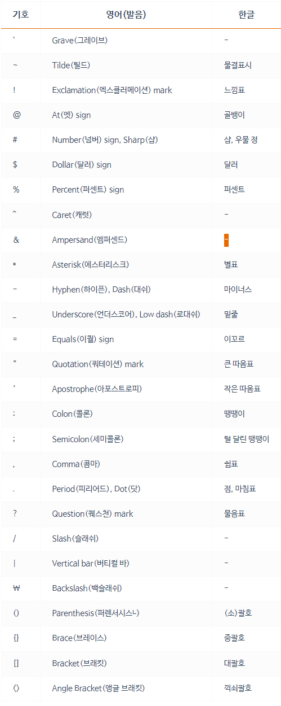

# 특수 문자 용어 정리 
코딩을 하다보면 여러가지 특수문자를 만나게되는데, 

정식 용어와 위치를 알아두자.

[참고사이트-heropy](https://heropy.blog/2019/04/24/html-css-starter/)

## 특수기호 사용법

특수기호를 그대로 작성하게되면, 후에 에러가 날 수 있다.

처음에 우리가 작성한대로가 아닌, 다른 모습으로 출력될 수 있기때문에

Entity Name으로 작성한다.

이 Entity Name으로 작성하면, 자동으로 특수기호로 변환된다.

예) & 사용시 &amp 로 작성한다.

[Entity list](https://www.freeformatter.com/html-entities.html)

