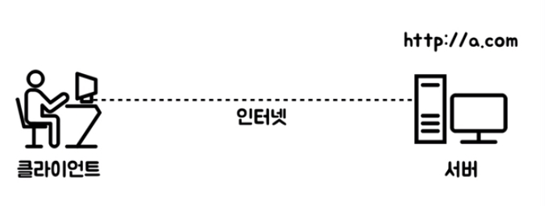

# client server 클라이언트와 서버

(이미지출처 : 생활코딩)

## 클라이언트(client) 

웹브라우저가 설치되어있는 컴퓨터가 클라이언트

클라이언트는 정보를 요청하는 주체를 말한다. 

카페를 예를들어 커피를 주문하는 손님이 클라이언트가 되고, 커피를 제공하는 직원이 서버가 된다.

이러한 클라이언트는 플랫폼에 따라 구분되는데, 브라우저를 통해 이용하는 웹의 클라이언트는

웹사이트/ 웹앱, 안드로이드와 같은 스마트폰,태블릿 플랫폼에서 이용하는 앱도 클라이언트가 된다.

## 서버(server)

서버는 serve제공하다 그대로 클라이언트의 요청에 응답, 제공하는 하는 주체.

