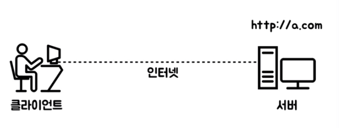

# client server 클라이언트와 서버

(이미지출처 : 생활코딩)

## 클라이언트(client) 

웹브라우저가 설치되어 있는 컴퓨터가 클라이언트

클라이언트는 정보를 요청하는 주체를 말한다. 

카페를 예를들어 커피를 주문하는 손님이 클라이언트가 되고, 커피를 제공하는 직원이 서버가 된다.

이러한 클라이언트는 플랫폼에 따라 구분되는데, 브라우저를 통해 이용하는 웹의 클라이언트는

웹사이트/ 웹앱, 안드로이드와 같은 스마트폰,태블릿 플랫폼에서 이용하는 앱도 클라이언트가 된다.

## 서버(server)

서버는 serve제공하다 그대로 클라이언트의 요청에 응답, 제공하는 하는 주체.

## 데이터베이스(database)
서버는 정보를 제공할뿐 저장하고있지 않는다.

정보들이 저장된 데이터베이스에서 가져와 제공하는 것이다.

이렇게 클라이언트-서버-데이터베이스의 형태를 3티어 아키텍처라고한다.

## 그렇다면 클라이언트와 서버는 어떤식으로 통신할까? 

위에서 예로 들었던 카페로보자면, 손님이 주문을해야 커피가 나온다.

이처럼 클라이언트가 정보를 요청해야 서버가 정보를 주는것이다.

(하지만 간혹 서버에서 요청하지않은 정보를 전달하는 경우가 있다. 이 경우가 "쿠키"이다. 이부분은 나중에 다룸)

클라이언트와 서버간의 통신을 알려면 프로토콜을 알아야한다.