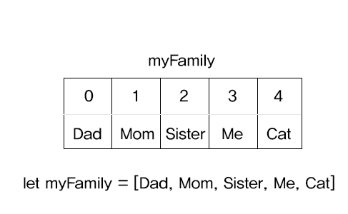

# Array 배열
데이터를 일반 변수에 담는 것보다 더 편리하게 보관하고, 관리하는 것이 배열

우리 가족을 나타내고 싶을 때 

변수로만 표현한다면 이렇게 표현이 된다.

굳이 변수를 하나하나 생성해야하고, 한번에 관리하기가 불편하다.

```
const dad = 'Dad';
const mom = 'Mom';
const sister = 'Sister';
const me = 'Me';
const cat = 'Cat';
```

## 배열로 표현하면?
하나의 변수(전체를 아우르는)를 생성해, 대괄호 안에 값을 넣는다.

```
const myFamily = ['Dad', 'Mom', 'Sister', 'Me', 'Cat'];
```
배열안에는 string값은 물론 다른 모든 값을 사용할 수 있다. (null,변수,number..등)

## 배열의 값 가져오기

myFamily에서 두번째에있는 Mom이라는 값을 가져오고 싶다면

변수명[인덱스값]
```
myFamily[1];
```
Mom은 분명 두번째에 있는데 왜 1을 쓰냐면, 컴퓨터는 사람과 달리 숫자를 0부터 센다.
그것이 바로 인덱스넘버.



## 배열의 값 변경하기

Me라는 값을 I로 바꾸어보자.

변수명[바꾸고싶은값의 인덱스값] = 새로운값
```
myFamily[3] = 'I';
```

## 배열의 값 추가
- 배열의 앞에 추가 - unshift(추가할값)

```
myFamily.unshift('Grandfather');
//출력 myFamily = ['Grandfather', 'Dad', 'Mom', 'Sister', 'Me', 'Cat'];
```

- 배열의 뒤에 추가 - push(추가할값)

```
myFamily.push('Grandfather');
//출력 myFamily = ['Dad', 'Mom', 'Sister', 'Me', 'Cat', 'Grandfather'];
```


## 배열의 값 삭제
- 배열의 앞에서 삭제 - shift()
```
myFamily.shift();
//출력 myFamily = ['Mom', 'Sister', 'Me', 'Cat'];
```
- 배열의 뒤에서 삭제 - pop()
```
myFamily.pop();
//출력 myFamily = 'Dad',['Mom', 'Sister', 'Me'];
```

## 배열에서 특정값 찾기
myFamily에서 Cat의 위치를 알고 싶다면?
```
myFamily.indexOf('Cat')
//출력 4 
```
만약없는 값을 찾으면 -1이 출력된다.
