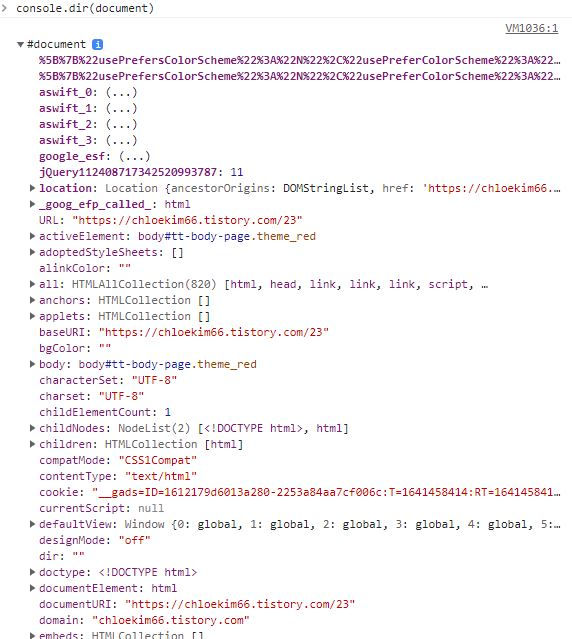

# DOM (Document Object Model)

dom이란 프로그래머(개발자)의 관점에서 바라본 HTML을 말한다.

html문서(원본)를 찾아가 수정하지않고, html에 자바스크립트를 연결해 html을 조작할 수 있다.

DOM을 사용하려면  document. 으로 시작해야하는데 console.dir(document)을 해보면

document는 객체이고, 그안에서 사용할 수 있는 모든것들을 확인 할 수 있다.



```
//html 예시
<body>
    <div class="container">
      <h1 class="title">Hello</h1>
        <ul>
            <li class="list">아이템1</li>
            <li class="list">아이템2</li>
            <li class="list">아이템3</li>
            <li class="list">아이템4</li>
        </ul>
    </div>

</body>
```

## DOM 사용하기 
- 원하는 엘리먼트 선택하기 - querySelector

옛날에는 getElementBy~로 시작하는 매서드들을 사용했었는데

요즈음 사용하지않는다. querySelector로 찾으면 css방식으로 사용이 가능하여 편리하다.
```
//Hello라는 h1태그를 찾고싶다면
document.querySelector(".title");
```

- 여러개 엘리먼트 선택하기 - querySelectorAll
```
//list라는 클래스를 가진 가장 상단 아이템1 선택.
document.querySelector(".list");

//list라는 클래스를 가진 아이템 전부 선택
document.querySelectorAll(".list");
```


//이벤트 만들기
//1. 이벤트리스너 만들기
//2. 이벤트 발생시 실행할 함수 만들기
//3. 연결.
const title = document.querySelector(".hello h1");

function handleTitleClick(){
 title.style.color = "blue";
}

function handleMouseEnter(){
    console.log("Mouse is here");
   }

   function handleMouseLeave(){
    console.log("Mouse is gone");
   }

//event를 listen하도록 
//click이라는 이벤트 발생시, handleTitleClick이라는 함수 실행
title.addEventListener("click", handleTitleClick);
title.addEventListener("mouseenter", handleMouseEnter);
title.addEventListener("mouseleave", handleMouseLeave);

//사용할 수 있는 이벤트 검색방법은 MDN or 객체 console.dir하기