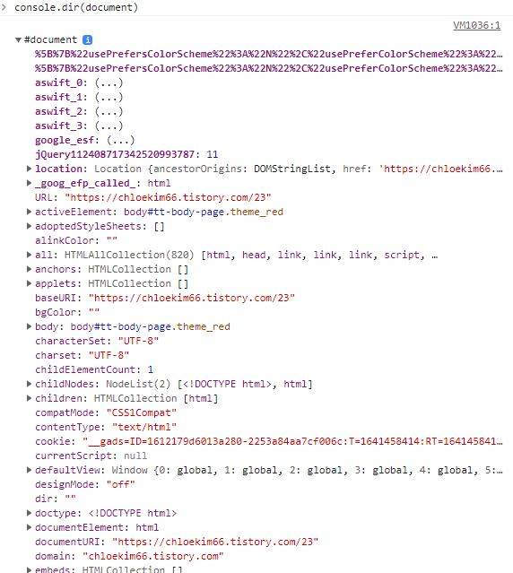

# DOM (Document Object Model)

dom이란 프로그래머(개발자)의 관점에서 바라본 HTML을 말한다.

html문서(원본)를 찾아가 수정하지않고, html에 자바스크립트를 연결해 html을 조작할 수 있다.

DOM을 사용하려면  document. 으로 시작해야하는데 console.dir(document)을 해보면

document는 객체이고, 그안에서 사용할 수 있는 모든것들을 확인 할 수 있다.



```
//html 예시
<body>
    <div class="container">
      <h1 class="title" id="title">Hello</h1>
        <ul>
            <li class="list">아이템1</li>
            <li class="list">아이템2</li>
            <li class="list">아이템3</li>
            <li class="list">아이템4</li>
        </ul>
    </div>

</body>
```

## DOM 사용하기 
- 옛날버전  getElementBy~

옛날에는 getElementById, getElementByClassName 등의 매서드들을 사용했었는데
getElementById는 말그대로 아이디만 찾을 수 있고, getElementByClassName은 class만 찾을
수 있다. 따로 #나 .을 붙이지않아도 된다.
```
//사용법
getElementById('title')
getElementByClassName('title')
```

- <요즘사용> 원하는 엘리먼트 선택하기 - querySelector


 요즈음에는 querySelector를 이용해 원하는 아이디, 태그, 클래스를 다 찾을 수 있다.

 또 css방식이라 사용이 더 편리하다.
```
//title 클래스로 찾기
document.querySelector(".title");
//title id로 찾기
document.querySelector("#title");

```

- 여러개 엘리먼트 선택하기 - querySelectorAll
```
//list라는 클래스를 가진 가장 상단 아이템1 선택.
document.querySelector(".list");

//list라는 클래스를 가진 아이템 전부 선택
document.querySelectorAll(".list");
```
- 자식요소 찾기

css 사용법과 동일하다.
```
//list의 첫번째 li 선택하기.
document.querySelector("ul li:first-child");
```


