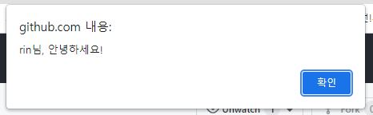

# Function 함수
계속해서 반복해서 사용이 가능한 코드 조각.

우리가 흔히 볼수있는 예를 들어 설명하자면,

사이트에 유저가 로그인했을 때
xxx님, 안녕하세요! 라는 알림창를 보여주고 싶다.

이것을 매번 치는것은 굉장히..비효율적인 일.

그래서 반복되는 일을 함수로 만들어 놓는다.

## 함수 만들기

```js
function greeting(user){
 alert(user +"님, 안녕하세요!")
}
```
함수의 기능을 알수있도록 함수명을 지어주고 소괄호에는 받을 값(매개변수),

중괄호에는 해당값을 받으면 실행할 액션을 적어준다.

## 함수 실행하기
함수명() 

실행할 함수뒤에 소괄호를 열고닫아줘야 실행한다는 의미이다.

또 괄호안에 원하는 값을 넣어주면 그값을 받아 함수를 실행한다.
```
greeting("rin");
```
함수 실행시 보이는 알림창



## 함수 return

console.log나 alert으로 일시적으로 잠시보이는게 아닌,

함수값을 이용해 무엇인가를 하기위해서는 꼭 return을 해줘야한다.

이것이 함수 밖으로 값을 출력하는 방법.

```js
function greeting(user){
 return user +"님, 안녕하세요!";
}
```
