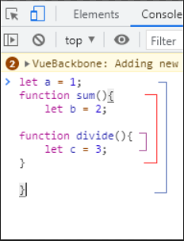

# 스코프 (Scope)
스코프란 '범위'라는 뜻으로 자바스크립트에서는 변수에 접근할 수 있는 범위를 뜻한다. 

그럼 변수에 접근할 수 있는 범위는 무슨말일까?

우리가 자바스크립트에서 변수(var,let,const 등)를 선언하면

선언된 변수가 사용될 수 있는 범위를 가지게 된다.
## 스코프 종류
이 범위에따라 변수가 두가지로 나뉘는데 전역변수와 지역변수로 나뉘게된다. 
- 전역변수

자바스크립트 파일 전 범위에서 사용가능

- 지역변수

변수가 선언된 함수내에서만 사용가능

예) 
```js
let num = 1; //전역변수

function changeNum(){
  let num = 2; //지역변수
  console.log(num);
}

console.log(num);

//1출력
```

함수안에서 num에 2를 담아주었지만, 그 결과는 해당 함수에서만 유효하다.

따라서 console.log를 함수 밖에서 해주었기에 값은 원래 선언한 1이된다.

## 스코프 규칙

- 바깥쪽에서 선언된 변수 안쪽에서 사용 가능하다 (ex.전역변수 함수안에서 사용가능)
 
  안쪽에서 선언된 변수 바깥쪽에서 사용 불가능
  
- 스코프는 중첩이 가능하다(변수의 사용범위가 겹친다는 말!)

예를 들어 설명하자면 이렇게 제일바깥에 전역변수 a가 선언되어있고

그안에 함수 sum에는 지역변수 b가 선언되어있고 

함수 sum안에 함수divide 안에는 지역변수 c가 선언되어있다.


파랑범위는 전역변수 a만사용가능/빨강범위는 a,b 사용가능/보라색범위는 a,b,c 사용가능

 