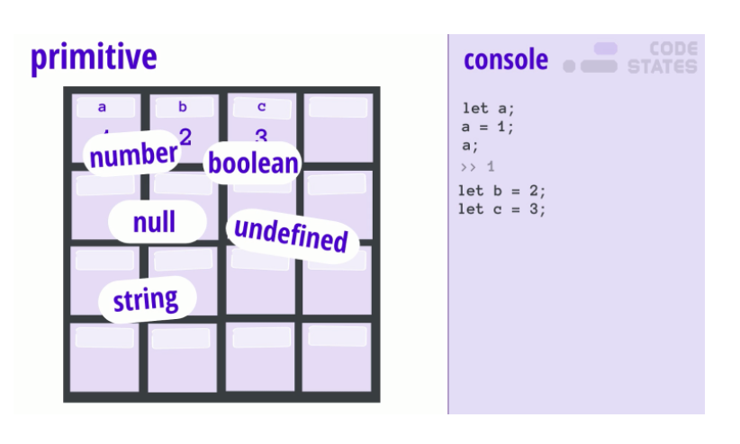
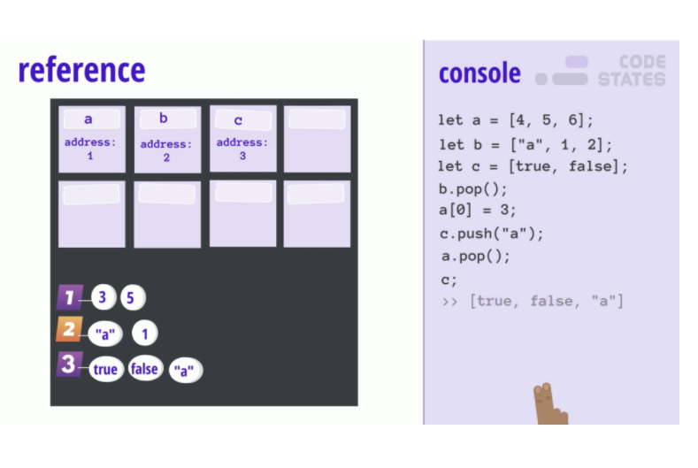

# data types and structures 
JavaScript의 타입과 자료구조 


## 자료형이란?
이젠 자바스크립트 타입에서 정리한 

string, number, null, 불리언, 배열, 객체 등을 말한다.

이러한 자료형을 두가지로 나눌 수 있는데 원시자료형(원시값)/참고자료형(참고값)이다.

- 원시자료형

     종류 : String, Number, Boolean, Null, Undefined

     특징 : 

   1.  불변 값(변경할 수 없는 값)이다. 

   2. 하나의 데이터만 담는다.
     ```js
     let a = 1; //number 원시값할당
     b = a;
     
     b = 2;

     a; //1 a값 그대로.
     b; //2

     ```
     


     

- 참조자료형

    객체, 배열, 함수

    특징 : 
    1. 값을 변경할 수 있다.

    2. 여러개의 값을 가진다.
    3. 여러개의 값을 관리하기위해 heap이라는 데이터 보관함에 값을 저장하고, 

       변수에는 그 값의 주소가 저장된다.
     ```js
     let a = [4, 5, 6, 7, 8];
     let b = a; 

     b[0] = 1;

     a; //[1, 5, 6, 7, 8]  a의 첫번째 값이 바뀌었다.
     b; //[1, 5, 6, 7, 8]

   
     ```
  


# 얕은 복사, 깊은 복사

복사에는 두가지가 있는데, 자료형에 따라 복사가 달라진다.

위의 예시에서 보았듯이 원시자료형은 원래의 값이 바뀌지 않았다.

그 이유는 원시자료형은 하나의 값만 가질 수 있기에 값을 복사 할때 다른 메모리에 할당한다.

따라서 원래의 값과 복사된 값이 서로에게 영향을 미치지 않는 것이다.


- 얕은 복사(shllow Copy)

객체를 복사할때 위의 원래값과 복사된 값이 같은 참조를 가리키고있는 것을 말한다.

**같은 참조를 가르키기에 복사된 값을 수정하면, 원래의 값도 수정되어 버린다.**

예) Array.prototype.slice(), Object.assign(), Spread 연산자


- 깊은 복사(Deep Copy)

 원본과의 참조가 완전히 끊어진 객체를 말한다.

 예) JSON.parse && JSON.stringify, 재귀함수를 이용한 복사, 라이브러리 사용