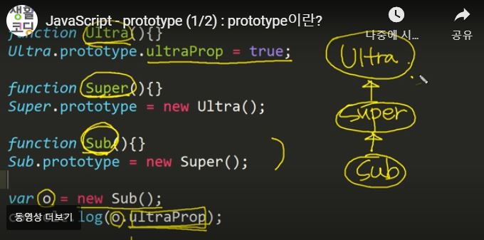

# 객체지향_상속

객체의 상속이란 새로운 객체가 원래의객체, 부모객체에서 변수와 메소드를 그대로 물려받아 동일한 기능을 할 수 있는 것을 말한다.

중요한 것은 그대로 물려받는다면 굳이 상속을 할 필요가 없다.

상속을 받은 객체는 부모의 기능에서 자신의 맥락에 맞게 기능을 추가하거나, 제거한다.

```js
//기본코드
function Person(name){ //name받기
    this.name = name;
    this.introduce = function(){
        return `My name is ${this.name}`;
    }
}

const rin = new Person('rin');
console.log(rin.introduce()); //My name is rin
```

이 기본코드를 상속을 하기위한 코드로 수정해보자.
```js
function person(name){
    this.name = name;
}

Person.prototype.name = null;
Person.prototype.introduce = function(){
    return `My name is ${this.name}`;

```
이렇게 기본셋팅에 값을 넣지않고, prototype을 이용해 값을 넣어도
출력되는 값은 동일하다.

## 상속

객체 programmer를 만들고, 그 객체의 인스터스 p1을 만든다.(rin)

```js
function Person(name){
    this.name = name;
}
Person.prototype.name=null;
Person.prototype.introduce = function(){
    return `My name is ${this.name}`;
}
 
function Programmer(name){
    this.name = name;
}
Programmer.prototype = new Person();
 
const p1 = new Programmer('rin');
console.log(p1.introduce());

```
그리고 p1.introduce()을 하면 My name is rin 이 출력되는 걸 확인할 수 있다.

분명 p1과 Programmer에는 introduce라는 매서드가 존재하지 않는데 어떻게 출력할 수 있을까?

이부분에서 상속이 일어난것인데.

Programmer.prototype = new Person(); 

이렇게 prototype을 이용해서 인스턴스를 만들면
Person에서 prototype이 작성되었는지 확인한다. 그리고 작성되어있다면
그 부분을 상속받는다.


## 상속받은 객체에 기능추가
```js
function Person(name){
   this.name = name;
}
//상속될 부분
Person.prototype.name = null;
Person.prototype.introduce = function(){
    return `My name is ${this.name}`;
}

function Programmer(name){
    this.name = name;
}

Programmer.prototype = new Person(); //Person을 상속받음.

//기능추가
Programmer.prototype.coding = function(){
    return "Hello World";
}

const p1 = new Programmer('rin');// 객체 생성
console.log(p1.introduce()); //My name is rin
console.log(p1.coding()); //Hello World

```


# prototype(원형)
상속받기 위해 prototype이 사용되는데 이 prototype이 무엇인지
알아보자.


울트라, 수퍼, 서브 라는 객체가 있다.

그리고 제일마지막 o.ultraProp();를 하면

 o의 부모인 sub, sub의 부모인 super 그 부모인 ultra까지
올라가 상속을 받아 true라는 값이 출력된다. 이것이 prototype의 능력이다.

 **우리가 얻고자 하는 객체, 그 객체의 프로퍼티, 메소드가 저장된 곳이 prototype이다.**

```js
function Super(){}
Super.prototype = new Ultra();
 
function Sub(){}
Sub.prototype = new Super();
```
Sub.prototype = new Super(); 이것은 super생성자가 만든 객체가 담긴것이고

Super.prototype값으로 new Ultra(); 이것은 super생성자에 Ultra생성자가 만든 객체가 담긴것.

이렇게 위에서 부터 상속받아 prototype로 계속 내려오는것을

prototype chain이라고 한다.

# prototype chain

```js
function Ultra(){}
Ultra.prototype.ultraProp = true;
 
function Super(){}
Super.prototype = new Ultra();
 
function Sub(){}
Sub.prototype = new Super();
 
var o = new Sub();
o.ultraProp = 1;
console.log(o.ultraProp); //1출력

```
위와 동일한 코드인데 console.log(o.ultraProp)을 하면 true가 아닌 1이 출력된다.

그것은 과정은

1. 객체 o에서 ultraProp를 찾는다.(있다면 바로 그 값 출력)
2. 없다면 Sub.prototype.ultraProp를 찾는다.
3. 없다면 Super.prototype.ultraProp를 찾는다.
4. 없다면 Ultra.prototype.ultraProp를 찾는다.

!! 중요한건 

Super를 상속받고 싶을때 
```js
//올바른 방법
Sub.prototype = new Super();

//틀린방법
Sub.prototype = Super.prototype;
```

두번째 방법을 사용하게되면, 자식객체에게 새로운 값을 추가하거나, 삭제하면

부모객체까지 영향을 미친다.


참고사이트 [생활코딩](https://opentutorials.org/course/743/6573)