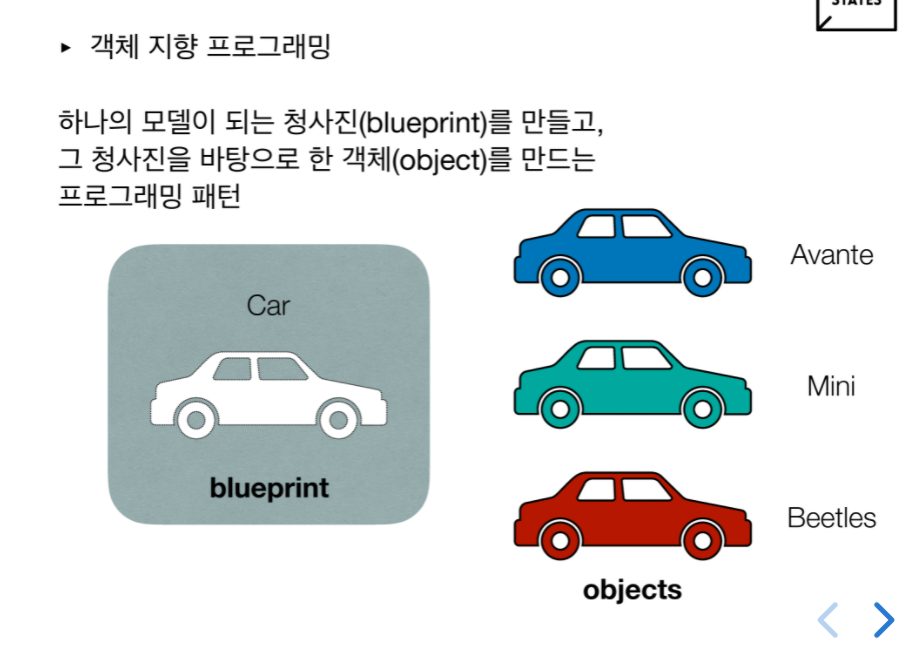

# 자바스크립트 - 객체 지향 프로그래밍
객체 지향 프로그래밍(OOP, Object-oriented programming)이란?

컴퓨터 프로그래밍 패러다임중 하나로, 프로그래밍에서 필요한 데이터를 추상화시켜 상태와 행위를 가진 객체를 만들고 그 객체들 간의 유기적인 상호작용을 통해 로직을 구성하는 프로그래밍 방법이다.

쉽게 말하자면, 개발자가 원하는대로 틀을 만들고 (함수나 클래스)
그 틀에 new 키워드를 이용해 인스턴스를 만드는 것. 

즉 한개의 틀을 이용해 여러개를 만들어낼수 있어 재사용이 가능.

## 객체 instance


객체는 변수와 메소드를 담은 그릇이라고 할수 있다.

객체안에서 정의된 변수를 프로퍼티(속성)이라고 하고, 함수를 메소드 라고한다. 

사진에서 보이듯이 car 객체를 이용해 car에 속하지만 자신의 특성을 가지고있는

오브젝트들을 만들어 낼 수 있다.

## instance 만들기

 가장 기초적인 object만드는 방식, 빈 객체를 만들고
 하나씩 값을 넣어준다.
 여기서 brand, name, color 이 변수들이 프로퍼티가 되고,
 함수 introduce가 메소드가 된다.
 ```js
const car = {} //빈객체 만들고

car.brand = "hyundai";  //값 넣어주기.
car.name = "avante";
car.color = "white";
car.introduce = function(){
    return `${this.name} is my car` ;
}
 ```

위에서는 객체를 따로 만들고, 값을 정의했지만,
객체를 만들면서 
기본값을 셋팅할 수 있다.
```js
//객체를 만들면서 기본값 셋팅하기.
const car = {

 'brand' : 'hyundai',
 'name'  : 'avante',
 'color' : 'white',
 'introduce' : function(){
    return `${this.name} is my car` ;
}
}
```


 ### 여기서 다른차 종류의 객체를 만들고 싶다면 ??

```js
//아반떼
const car1 = {

 'brand' : 'hyundai',
 'name'  : 'avante',
 'color' : 'white',
 'introduce' : function(){
    return `${this.name} is my car` ;
}
}

//미니
const car2 = {

 'brand' : 'bmw',
 'name'  : 'mini',
 'color' : 'navy',
 'introduce' : function(){
    return `${this.name} is my car` ;
}
}
```

이렇게 작성하면 중복되는 부분이 굉장히 많이 발생한다

코드 중복 > 유지보수 어려움, 코드량 늘어남, 메모리 차지 등의 이유로

이렇게 만들지 않고 객체를 재사용하기위해 "생성자"를 사용한다.

---------------------------
## constructor 생성자

생성자는 객체를 만드는 역할을 하는 함수다.

먼저 가장기본적인 함수 car를 만들고

변수를 하나만들어 그 함수를 할당해보자.

```js
function car(){}; //기본함수
const c1 = car(); //변수에 함수 할당

c1 ; //undefined
```
이렇게 출력시 undefined가 나온다. 이제 new 키워드를 사용해보면
```js
function car(){}; 
const c2 = new car();

c2; //car {}
```
car {}는 비어있는 객체이다. 함수에 new를 붙이면 뒤에오는 함수가 객체가 된다. 


이 new 키워드를 이용해서 위에 중복되는 코드를 바꿔보면
전체적인 틀이되는 함수를 하나만들고,

new 키워드를 이용해서 인스턴스를 만들어준다.
이때 car함수를 보면 각각 내용이 바뀌는 값(brand, name, color)을 받고있고,

각각의 인스턴스들은 해당되는 값을 순서대로 인자로 넣어준다.

```js
function car(brand, name, color){ //바뀌는 값 받기.
    this.brand = brand;
    this.name = name;
    this.color = color;
    this.introduce = function(){
    return `${this.name} is my car` ;
    }
}

const avante = new car("hyundai", "avante", "white"); //(brand, name, color)순으로 
const mini = new car("bmw", "mini", "navy"); //(brand, name, color)순으로 

```
