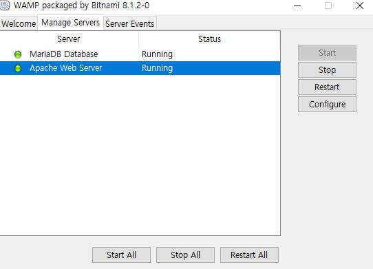

# MySQL


데이터베이스란 ?

여러 사람이 공유하여 사용할 목적으로 체계화해 통합, 관리하는 데이터의 집합이다. 작성된 목록으로써 여러 응용 시스템들의 통합된 정보들을 저장하여 운영할 수 있는 공용 데이터들의 묶음이다. -구글검색


MySQL이란?

정보를 저장할 수 있는 오픈소스 데이터베이스.

무료로 이용할 수 있기때문에 많은 사람들이 사용하고있지만,

상업적으로 이용하려면 별도의 라이센스 구매가 필요하다.

## 1. 설치하기

https://www.mysql.com/downloads/


MySql community Downloads 클릭

no thanks~클릭


<br/>

설치 완료 후 설치된 폴더에 들어가 manager-windows.exe 열기.

manager-windows.exe : apache,mysql을 제어하는 프로그램


manage servers에서 녹색상태라면, 실행중이고 

빨간색이라면 중지된 상태이다. 
(현재 둘다 실행중이라 apache는 사용안할거라 stop했다.)

## 2. 실행하기
윈도우 + R 누르고,
cmd 실행
```node
/mysql -uroot -p
```
비밀번호 입력.

만약 mysql이 내 컴퓨터가 아닌, 다른 컴퓨터에 존재한다면

-u 앞에-h와 해당주소를 적어준다.

예)opentutorials.org의 3300포트에 접속시

```node
./mysql -hopentutorials.org -P3300 -uroot -p


[참고사이트 - 생활코딩](https://opentutorials.org/course/2136/12020)