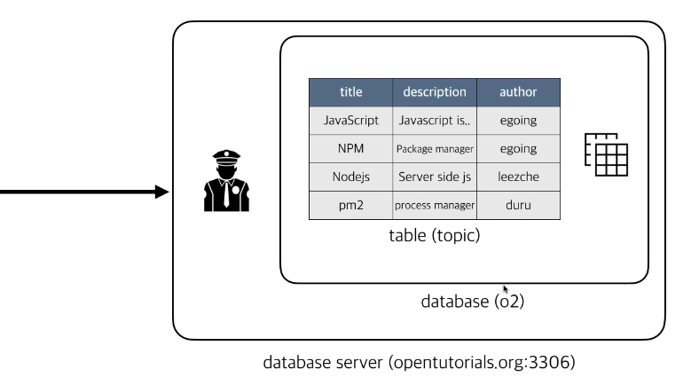

# mysql 구조



mysql에 접속할때, 아이디와 비밀번호를 입력 후 로그인을 해야 

데이터베이스 서버에 접근이 가능하다.

데이터베이스는 소프트웨어자체고, 데이터베이스는 테이블들의 모음

## 데이터베이스 생성
CREATE DATABASE 데이터베이스이름;
```node
CREATE DATABASE o2;
```
데이터베이스 만들어졌는지 확인하기
```node
 SHOW DATABASES;
```

## 데이터베이스 사용
테이블을 만들기위해선, 해당 데이터베이스에 들어가서 테이블을 생성해야한다.

폴더를 만들고, 그안에 파일을 만드는것과 같다.

use 데이터베이스이름;
```node
 use o2;
```
현재 상태확인 - 비어있는지, 만들테이블이 이미 있는지 확인
```node
SHOW TABLES;

<!-- 현재 empty상태 -->
```

## 테이블 생성
```
<!-- 생성법 -->
create table 테이블명(
    필드명 타입,
    필드명 타입
PRIMARY KEY(필드명)
);

<!-- 생활코딩 테이블 예시 -->
CREATE TABLE `topic` (
`id` int(11) NOT NULL AUTO_INCREMENT,
  `title` varchar(100) NOT NULL,
  `description` text NOT NULL,
  `author` varchar(30) NOT NULL,
  PRIMARY KEY (id)
) ENGINE=InnoDB DEFAULT CHARSET=utf8;
```
다시 SHOW TABLES;해보면 topic 테이블이 생성된걸 확인 할 수 있다.

id  : 테이블을 구분하기위한 넘버

AUTO_INCREMENT : 행을 추가할때, id를 지정하지않아도 자동으로 설정된다.

## 데이터 추가
문법
```
INSERT INTO 테이블명 [컬럼1, 컬럼2, ...] VALUES (값1, 값2, ...);
```

해당하는 값을 순서대로 넣어줘야한다.
```node
INSERT INTO topic (title, description, author) VALUES('JavaScript','Computer language for web.', 'egoing');
```

## 데이터 가져오기

문법

```
SELECT 필드이름 FROM 테이블이름[WHERE 조건]
```
```
// topic테이블에서 모든정보 가져오기 
AUTO_INCREMENT기능으로 id값을 주지않아도 자동설정되었다.
SELECT * FROM topic;

//출력
+----+------------+----------------------------+--------+
| id | title      | description                | author |
+----+------------+----------------------------+--------+
|  1 | JavaScript | Computer language for web. | egoing |
+----+------------+----------------------------+--------+
```

where를 사용해보자. where은 특정한 하나의 행만 가져올때 사용된다.

2값까지 일단 추가를하고,

```
//현재상태
+----+------------+----------------------------+---------+
| id | title      | description                | author  |
+----+------------+----------------------------+---------+
|  1 | JavaScript | Computer language for web. | egoing  |
|  2 | NPM        | Package manager            | leezche |
+----+------------+----------------------------+---------+

//2행만 가져오기
SELECT * FROM topic WHERE id=2;

//출력
+----+-------+-----------------+---------+
| id | title | description     | author  |
+----+-------+-----------------+---------+
|  2 | NPM   | Package manager | leezche |
+----+-------+-----------------+---------+
```

## 데이터 수정
문법
```
UPDATE 테이블이름
SET 필드이름1=데이터값1, 필드이름2=데이터값2, ...
WHERE 필드이름=데이터값
```

예) 2행의 NPM을 소문자npm으로 바꾸기

topic테이블의 title값을 npm으로 바꾸고싶다. 어디있는? 2행에 있는
```
UPDATE topic SET title='npm' WHERE id=2; 

//출력해보면
+----+-------+-----------------+---------+
| id | title | description     | author  |
+----+-------+-----------------+---------+
|  2 | npm   | Package manager | leezche |
+----+-------+-----------------+---------+
```

## !! 여기서 WHERE문을 깜빡했다면 진짜 큰일난다.

## 모든행의 title이 바뀐다... > 데이터가 유실된다.

<br />

## 데이터 삭제
문법

WHERE문을 생략하면, 테이블의 모든 값이 삭제된다.

```
DELETE FROM 테이블이름
WHERE 필드이름=데이터값

//2행 지우기
DELETE FROM topic WHERE id=2; 

//SELECT * FROM topic;
+----+------------+----------------------------+--------+
| id | title      | description                | author |
+----+------------+----------------------------+--------+
|  1 | JavaScript | Computer language for web. | egoing |
+----+------------+----------------------------+--------+
```


[참고사이트 - 생활코딩](https://opentutorials.org/course/2136/12020)