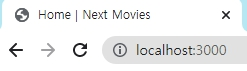

# Patterns
많은 사람들이 NextJs를 사용할때 쓰는 패턴이 있는데 바로 레이아웃 패턴이다.

## 01. 사용법

1. Layout.js를 생성해, Layout컴포넌트를 만든다

```js
//components/Layout.js
export default function Layout(){
    return(
        <>
        </>
    )
}

```
2. _app.js파일에서 Layout 컴포넌트로 보여줄부분을 감싸준다.
```js
//pages/_app.js
import Layout from "../components/Layout";
import "../styles/globals.css";


function MyApp({ Component, pageProps }) {
  return( 
  <Layout>
  <Component {...pageProps} />
  </Layout>
  )
}

export default MyApp

```


3. children prop을 받아 넣어준다.

children은 react.js에서 제공하는 기본 prop이다.
이렇게 children을 작성한 부분이 2번에서 레이아웃

컴포넌트로 감싼 그부분을 보여준다.

커다란 react.js 컴포넌트를 쓰기보단 레이아웃으로 이렇게 끌어와 사용한다. 

그렇기때문에 header를 넣을수도있고, 다른 컴포넌트를 넣을수도 있고 활용법이 다양하다.

```js
//components/Layout.js
export default function Layout({children}){
    return(
        <>
        <div>{children}</div>
        </>
    )
}

```

4. 스타일도 줄 수 있다.
nextJS에서 제공하는 head를 사용해 head를 스타일링해보자.

먼저 import해주고
```js

//pages/index.js
import Head from 'next/head';

export default function Home() {
  return (
    <div>
      <Head>
        <title>Home | Next Movies</title>
      </Head>
     <h1>Hello</h1>
    </div>
  )
}
```
이렇게 작성하면, home의 title부분이 우리가설정한대로
바뀐다.



하지만 index.js에서만 사용했기에 다른페이지는 바뀌지 않는다.

매번 다른페이지에 Head를 복사붙여넣기 할 수 없으니 컴포넌트를 하나만든다.


5. 스타일주기2, 컴포넌트만들기

Title이라는 파일을 만들고, 컴포넌트도 생성해주었다.

이 컴포넌트는 title을 받고, 그 부분을 커스터마이징 할 수 있도록 한다.

```js
//component/Title.js
import Head from "next/head";

export default function Title({ title }) {
  return (
    <Head>
      <title>{title} | Next Movies</title>
    </Head>
  );
}


```

그럼이제 index.js와 about.js를  고쳐보자.

```js
//index.js
import Head from "next/head";
import Title from "../components/Title";

export default function Home() {
  return (
    <div>
      <Title title="Home" />
      <h1>Hello</h1>
    </div>
  );
}

//about.js
import Head from 'next/head';
import Title from '../components/Title';

export default function About(){
    return(
        <div>
      <Title title="About" />
            <h1>About</h1>
        </div>
    )
}
```
