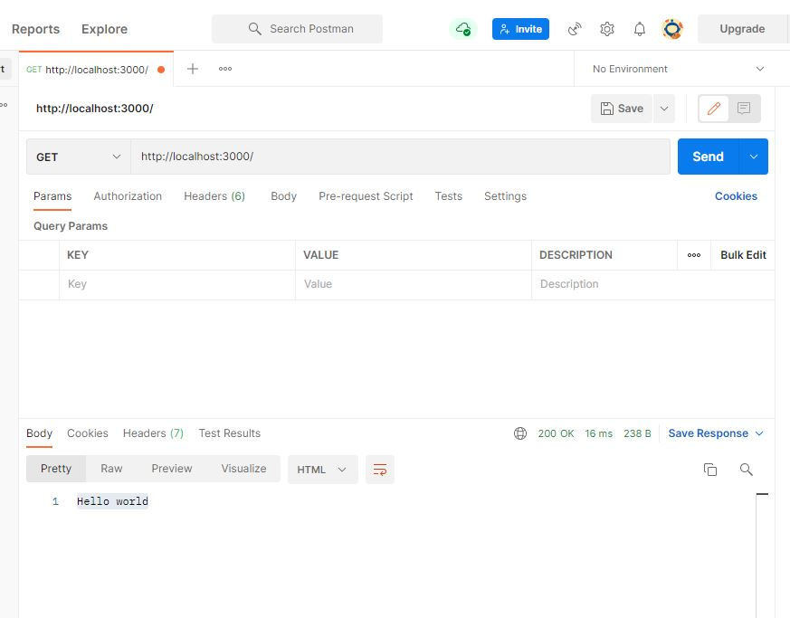

# nodeJS Express
nodeJS는 브라우저가 아닌 환경에서도 자바스크립트를 사용할 수 있게하는 자바스크립트 런타임이다.

nodeJS는 웹서버가 아니라, nodeJS로 무언가 할 수 없다. 그 대신에 http서버를 직접 구현해야한다.

## 0.1 Express란?

http를 직접 구현해야한다고 했는데, Express는 웹서버에서 필요한 기능이 이미 구현되어있는 프레임워크이다.

## 0.2 설치
먼저 node와 npm이 설치되어있으면 되고,
최신버전이 아니면 업그레이드한다
```node
업그레이드하기
npm install -g npm
```

1. 프로젝트를 할 폴더를 하나만들기

2. 해당폴더에 npm init

3. express 설치 (save로)
```node
npm install --save express
```

## 0.3 실행하기

1. main.js 생성
```js
//main.js
const express = require('express'); //모듈불러오기
const app = express(); //express생성하여 app에 담기


app.get('/', (req, res) => {  //get요청을 받으면
    res.send('Hello world'); //hello world 보내기
});

app.listen(3000, //기본설정 3000번 port로 연결하고,
() => console.log('App is listening on port 3000!')); //연결이되면 실행할 콜백함수
```

2. 실행
```node
node main.js
```

문제가 없다면 내가 작성한
App is listening on port 3000!이 

터미널에 출력될것이다. 따로 브라우저가 열리지 않아서
직접 열어야한다. 

[ 브라우저 확인시 ]
Hello world 가 보임

## 0.4 기본 라우팅해보기

express의 문법은 

app.METHOD(PATH, HANDLER)

이렇게 생겼다.

METHOD : get, phst, delete, put 등

PATH: 라우트 경로

HANDLER : 실행될 콜백 함수

main.js에 이 코드들을 추가해보자.
```js
//main.js
app.get('/user/:id', (req, res)=> {
    res.send('Received a GET request, param:' + req.params.id);
});

app.post('/user', (req,res) => {
    res.json({success:true})
});

app.put('/user', (req,res) => {
    res.status(400).json({message:'Hey, you. Bad Request!'})
});

app.delete('/user', (req,res) => {
    res.send('Received a DELETE request');
});
```

서버를 껏다가 재시작해보면, 첫화면에는
Hello world, 

[get요청]
```js
app.get('/user/:id', (req, res)=> {
    res.send('Received a GET request, param:' + req.params.id);
});
```
그리고 get요청으로 보낸것을 확인해보면

url에 localhost:3000/user/12345 
이런식으로 작성하면

브라우저에 

Received a GET request, param:12345 가 보인다.

param뒷부분은 내가 작성한 그대로를 불러오는것.

그외의 다른 요청 post,put등은 브라우저에서 확인할수가 없어 API 테스팅 도구인 POSTMAN을 사용해보자.

## 0.5 POSTMAN

POSTMAN을 설치하고, workspace를 만든다.

먼저 브라우저로 확인한 get요청이 잘보이나 확인해보자.

get으로 설정하고, 

http://localhost:3000/ 를 입력후

send를 누르면 

하단에 Hello world가 출력된다.




