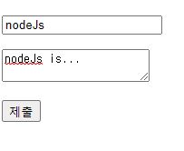

# GET방식 POST방식

## GET 방식
사용자가 서버에 정보를 요청해 가져오는, get하는 방식

예) 정보에 대한 주소를 나타낼때 - 다른사람에게 상품링크 공유시 그 화면이 동일하게 보여짐.


## POST 방식

사용자의 정보를 서버로 전송, 보내는 방식

예) 데이터가 노출되면 안될때 - 로그인시 아이디와 비밀번호

전송되는 데이터가 굉장히 많을 때 - 본문 내용이 너무 많으면 url 중간에 끊김.

## get, post 비교

html(pug로 작성)의 form태그로 사용자의 정보를 전달하면서,

get 요청과 post요청을 비교해보자.

이렇게 form태그의 method를 생략하면 기본적으로 get요청이 된다.

```pug
  body 
      form(action="/form_receiver") 
          p
            input(type="text" name="title") 
          p 
            textarea(name="description")
          p 
            button(type="submit") 
```
title에 nodeJs, description에 nodeJs is...를 작성하고 제출하였다.


- get 방식으로 제출

기존url : localhost:3000/form 

변경된url :  localhost:3000/form_receiver?title=nodeJs&description=nodeJs+is...


브라우저: nodeJs,nodeJs is...

url에서 우리가 입력했던 값을 찾을 수 있다.

이값을 가져올때 사용자가 입력했던 값은 request안에 쿼리에서 찾을 수 있으므로,

 title은 req.query.title, description은 req.query.description을 사용하면 된다.

 - post 방식으로 제출

method를 post로 바꾸고 동일한 내용을 전달하면,

기존url : localhost:3000/form 

변경된url :  localhost:3000/form_receiver 

브라우저 :  Cannot POST /form_receiver

### 그렇다면 post방식으로 제출한 값은 어떻게 찾을 수 있을까?

post로 값을 보내면, 그 값은 쿼리가 아닌 body에 저장이 되는데

req.body.title로 값을 가져올 수 없다. => 바디파서 미들웨어 설치필요

```js
//node
npm install body-parser --save

// app.js 
const bodyParser = require('body-parser')
app.use(bodyParser.urlencoded({ extended: false }))
```

바디파서를 설치하고, js상단에 모듈을 끌어오고, 사용하겠다고 설정해준다.

이 후 들어오는 모든 post요청은 바디파서를 거치게된다.

그리고 이제 req.body.title로 값을 가져올 수 있다.

브라우저 : nodeJs,nodeJs is...


