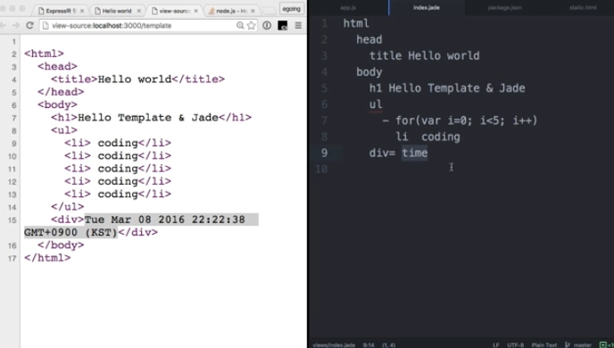

# 템플릿엔진 Jade > Pug
express의 템플릿 엔진 Jade가 Pug로 이름이 바뀌었다.

[참고사이트 - 생활코딩 제이드](https://opentutorials.org/course/2136/11915) 

## 1. 템플릿 엔진이란 ?

정적파일(html)과, 동적파일(js)의 장단점을 잘 결합한것.

템플릿엔진 종류: PUG, EJS(Effective Javascript Templatine) 등

ㄴ 템플릿 엔진을 사용하게 되면 짧은 코드로 복잡한 코드와 동일하게
짤 수 있다.


출처 생활코딩

퍼그로 위에 사진에서 오른쪽에 해당하는 것처럼 코드를 작성하면,

왼쪽의 html로 변환된다.

기존 html에서 사용할 수 없던 자바스크립트의 반복문이나,

변수 등을 사용하여 더 짧은 코드로 작성이 가능하다.

## 2. 설치 및 사용
[express-템플리트 공식문서](https://expressjs.com/ko/guide/using-template-engines.html)

```node
$ npm install pug --save
```
설치 후 해당 js에 코드2줄을 추가해주어야 하는데,

1. 템플릿 엔진 pug를 사용하겠다고 알려주기.
2. pug 파일의 위치 알려주기.

관습적으로 views라는 폴더를 만들고, pug 파일들을 거기에 넣는다.


```js
//app.js

//pug위치 알려주는 코드
app.set('views', './views'); 
//이것은 템플릿엔진으로 pug를 사용하겠다는 뜻이다.
app.set('view engine', 'pug'); 
```

## 3. 문법

좌측상단에 html 만 작성하면, html을 사용한다는 뜻이된다.

- 내부에 존재하려면 들여쓰기를 한다.

예) html안에 body가 있으려면
```pug
html
    body
```
- 줄바꿈은 태그로 인식한다.

예) h1태그에 hello PUG를 넣고싶을때
```pug
//- 올바른예
html
    body
        h1 hello PUG

//- 잘못된예 hello도 태그로 인식한다.
html
    body
        h1
            hello PUG
```

- 출력하는 코드가아닌 프로그래밍코드는 앞에 - 를 붙여준다.

예)js의 반복문 사용시 for앞에 - 붙이기

`<li>coding</li>`을 5번반복

```pug
//- views/temp.pug
html
    body
        h1 hello PUG
        ul
          -for(let i =0; i<5; i++>)
              li coding      
```
- 변수를 사용할때는, pug에서는 = 를, 정의는 js파일에

예) 변수 time이 현재시각을 나타내게 만들기
```pug
//- views/temp.pug
html
    body
        h1 hello PUG
        ul
          -for(let i =0; i<5; i++>)
              li coding  
        div= time    
 ```
pug파일 랜더링되는곳에 변수를 정의해준다.
 ```js         
// app.js
app.get('/template', function(req, res){
    res.render("temp",{ time:Date()})
}); 
```