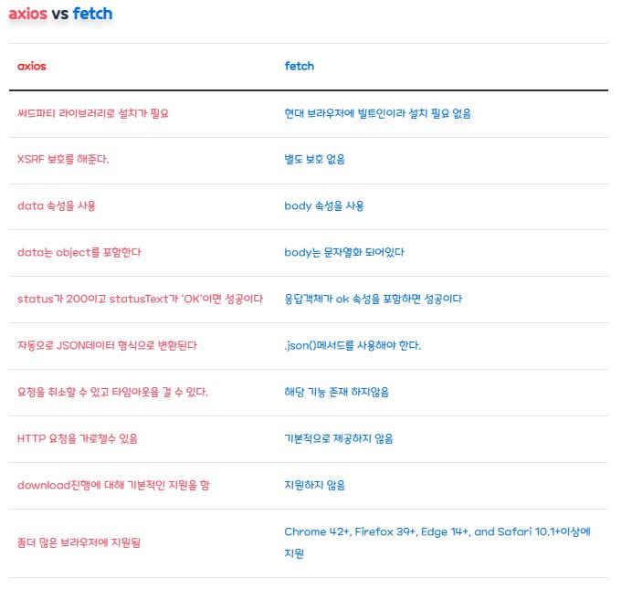

# Axios 액시오스 란?

브라우저, Node.js를 위한 Promise API를 활용하는 HTTP 비동기 통신 라이브러리
흔히 백엔드와 소통을 해야할때 사용된다

이미 자바스크립트에는 fetch api가 있지만, 프레임워크에서 ajax를 구현할땐 axios를 쓰는 편이다.


## axios 특징
1. Promise API 사용
2. HTTP 요청 취소 가능
3. 응답을 자동으로 JSON 형태로 변경

## axios / fetch 비교



출처 : https://inpa.tistory.com/entry/AXIOS-%F0%9F%93%9A-%EC%84%A4%EC%B9%98-%EC%82%AC%EC%9A%A9


## axios 설치하기
```node
npm install axios
```

## 사용하기

먼저 import를 해준다.
```js
import axios from "axios";
```

[ 기본문법 ]
```js
axios({
url : 'http://~' , //url 작성
method : 'get', // 통신방식
data : {  // 보낼 인자
   value : 'ddd'   } 
})
```

[ 단축 메소드 ]
기본문법과 결과는 동일하지만, 문법을 더 짧게 쓸 수 있다.
```js
axios.request(config)
axios.get(url[, config])
axios.delete(url[, config])
axios.head(url[, config])
axios.options(url[, config])
axios.post(url[, data[, config]])
axios.put(url[, data[, config]])
axios.patch(url[, data[, config]])

```

## 예제 (axios,fetch)
themoviedb 사이트에서 결과값받기

[ axios 사용 ]

```js
const url =  ='https://api.themoviedb.org/3/movie/popular?api_key=***';

//기본문법
 axios({
   url: 'url',
   method: 'get',
    }).then((res)=> console.log(res));

//단축
   axios.get('url')
   .then((res)=>console.log(res));

//fetch   
 fetch(('url'))
        .then((res)=>console.log(res.json()));
```

## 응용

1. axios 여러개 동시 요청
```js
function getUserAccount() {
  return axios.get('/user/12345');
}

function getUserPermissions() {
  return axios.get('/user/12345/permissions');
}

axios.all([getUserAccount(), getUserPermissions()])
  .then(axios.spread(function(acct,perm)  {
     console.log(acct,perm)
  }));
```

2. axios 인스턴스 만들기

```js
const instance = axios.create({
  baseURL: 'https://some-domain.com/api/',
  timeout: 1000,
  headers: {'X-Custom-Header': 'foobar'}
});
```

3. axios 전역 설정

   axios로 요청할때마다 동일한 header나 param이 필요하다면,
   한번 설정해 놓고 전역으로 사용하자.
```js
axios.defaults.baseURL = 'https://api.example.com';
axios.defaults.headers.common['Authorization'] = AUTH_TOKEN;
axios.defaults.headers.post['Content-Type'] = 'application/x-www-form-urlencoded';
```