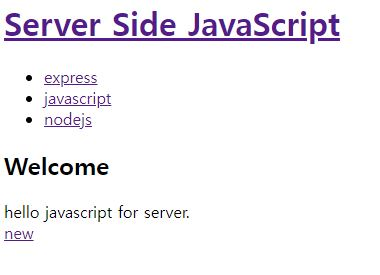

# 웹에플리케이션 제작
사용자가 입력한 타이틀을 리스트로 만들고,

해당 리스트 클릭시 입력한 본문을 보여주는 웹어플리케이션.

데이터베이스를 사용하지 않고, 파일로 저장됩니다.

엔트리파일 - app.js

### [ 폴더설명 ]
data  - 사용자가 입력한 데이터파일이 들어있는 폴더

views - 템플릿 엔진들이 들어있는 폴더

public - html,js파일들이 들어있는 폴더

[참고사이트 - 생활코딩](https://opentutorials.org/course/2136/11950)