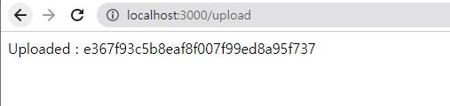
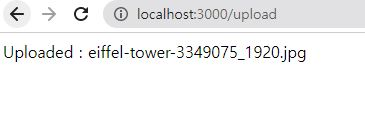

# multer
[multer 공식문서](https://github.com/expressjs/multer/blob/master/doc/README-ko.md)

html form에서 파일을 업로드하는 기능을 제공하지않기때문에 따로 미듈웨어를 설치해야한다 > multer

## 1.설치
npm install multer 

## 2.가져오기
```js
const multer = require('multer');
//파일 저장위치 지정
const upload = multer({ dest: 'uploads/' })
```

dest는 destination의 약자로 파일이 어느 폴더에 저장될건지 설정해준다.


[랜덤으로 설정된 파일이름]

dest로 설정되있을때 사용자가 파일을 보내면 파일이름이 랜덤으로 저장된다 

만약 사용자가 업로드한 그대로의 이름을 사용하고 싶다면,



[storage를 사용하여 사용자가 보낸 그대로의 파일이름]
dest대신 storage사용

## 3. storage 사용법
storage의 콜백함수를 수정해 원하는대로 변경이 가능하다.
```js
const storage = multer.diskStorage({
  destination: function (req, file, cb) {
    cb(null, 'uploads/')
  },
  filename: function (req, file, cb) {
    cb(null, file.originalname)
  }
})
const upload = multer({ storage: storage }
```

=> 또 다른방식으로도 사용할 수 있는데,

만약 사용자가 업로드한 파일이 이미지면 이미지폴더에,

텍스트면 텍스트폴더에 저장되기 설정가능

or

이미 동일한 이름의 파일이 존재한다면 파일명끝에 랜덤숫자붙이기


