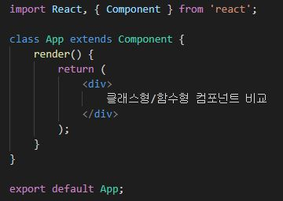
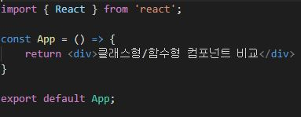

# 리액트 (React)
리액트란 페이스북에서 개발한 자바스크립트 오픈소스 라이브러리다.

리액트를 왜 써야할까 ? 

리액트는  1.가독성 2.재사용성 3.유지보수 이 3가지 특징을 가지고있다.

컴포넌트 기반이기 때문에 가능한 일이다.

## 컴포넌트 (Component)
컴포넌트란 프로그래밍에 있어 재사용이 가능한 독립된 모듈을 말한다.

더 쉽게 말하자면 하나의 기능을 가진 부분을 떼어서 이동하거나 재사용하는것

그렇기때문에 한번 만들어두면 간편하게 재사용이 가능하다.

예) A사이트의 날씨 컴포넌트를 B사이트로의 날씨컴포넌트로 사용가능.

### 컴포넌트 만드는 법

컴포넌트를 만드는 방법엔 클래스형과 함수형 두가지가 있다.

과거엔 클래스형을 많이 사용했지만 요즈음엔 리액트 hook을 지원해주기에

함수형 사용을 권장하고 있다.

- class형

1. class 필요
2. component로 상속받아야 함.
3. render() 메서드 필요
4. 함수형보다 메모리 많이 사용.

- 함수형

1. 컴포넌트 선언 필요
2. 클래스형봐 적은 메모리 사용.

### 컴포넌트 내보내기

### 컴포넌트 불러오기
