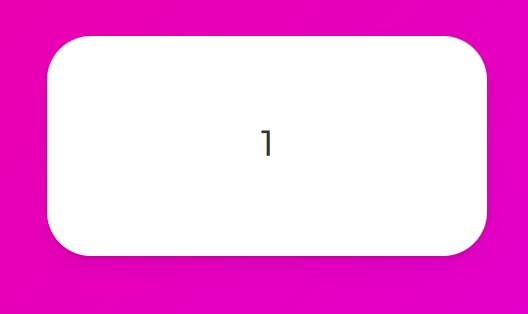

# AnimatePresence
AnimatePresence란 famerMotion에서 제공하는 기능으로 사라지는 것에 대해 애니메이션 효과를 줄 수 있게 한다.

## 예제) Slider만들기

1. < AnimatePresence>로 slide할 Box들 감싸기 (box가 여러개여야하니 일단 배열로 예제만들기)
```js
//App.js
import { motion, AnimatePresence } from "framer-motion";

function App() {
  return (
    <Wrapper>
      <AnimatePresence>
        {[1, 2, 3, 4, 5, 6, 7, 8, 9, 10].map((i) =>  <Box key={i}>{i}</Box>) 
        )}
      </AnimatePresence>
    </Wrapper>
  );
}
export default App;
```

2. useState로 state와 modifier만들기

```js
const [visible, setVisible] = useState(1);
```
이 visible값과 map의 i값을 비교하여,

같으면 박스가 보이고, 다르면 박스가 안보이게 설정

```js
const [visible, setVisible] = useState(1);

function App() {
  return (
    <Wrapper>
      <AnimatePresence>
           {[1, 2, 3, 4, 5, 6, 7, 8, 9, 10].map((i) =>
          i === visible ? (
            <Box key={i}> {i} </Box> ) : null )}
      </AnimatePresence>
    </Wrapper>
  );
}
```

여기까지 작성했다면, 기본값이 1이라, 현재 box1만보인다.



3. 다음으로 넘어가는 버튼과 함수만들기

클릭시 다음 box로 넘어가는 버튼을 하나 만든다.

```js
<button>next</button>
```

여기에 onClick으로 이벤트를 넣어줄것인데,

위에서 작성한 useState의 state modifier함수(setVisible)를 이용해 

현재 받은값이 마지막값이면 그대로 두고, 

마지막값이 아니면 현재값에 +1을 해준다.

```js
 const nextPlease = () => setVisible((prev) => (prev === 10 ? 10 : prev + 1));
```

[ 버튼에 연결한 모습 ]

```js
 <button onClick={nextPlease}>next</button>
```

이제 next버튼을 누르면 box가 다음으로 넘어간다.

-------------------------------------------

## Slider 정리 및 활용

이전 motion에서 배웠던 variants를 이용해

코드를 더 깔끔히, 완성도있게 작성해보자.

1. 먼저 variants를 만들고, 3단계로 나눠준다.

invisible/visible/exit

```js
//App.js
const box = {
  invisible: {},
  visible: {},
  exit: {},
};
```

2. Box에 연결하기

```js
            <Box
               variants={box}
               initial="invisible"
               animate="visible"
               exit="exit"
               key={i}
            > {i}</Box>      
```

3. 각 단계의 스타일 작성

```js
const box = {
  invisible: {
    x: 500, //오른쪽에서 나옴
    opacity: 0,
    scale: 0,
  },
  visible: {
    x: 0, //center
    opacity: 1,
    scale: 1,
      transition : {
      duration : .3,
    },
  },
  exit: { x: -500, opacity: 0, scale: 0 },
};
```

이렇게 작성하면, 처음 Slider보다 더 자연스럽고

예쁜 애니메이션을 구현할 수 있다.

과정을 조금 자세히 설명하자면 => 

처음 기본값이 visible과 같은데 next버튼을 클릭하는 순간 +1이 되서
visible과 값이 다르니 exit가 발생한다.

그래서 그 box는 exit에 적용된 style로 적용되어 사라지는것 처럼보인다.

4. prev 버튼 만들기(custom)

next의 반대인 prev버튼을 만들어보자.


```js
const nextPlease = () => setVisible((prev) => (prev === 10 ? 10 : prev + 1));
const prevPlease = () => setVisible((prev) => (prev === 1 ? 1 : prev - 1));
```

next의 반대로만들면 동작은 하지만, next와 같은 방향으로 사라진다.

prev는 box가 생성되는 방향이아닌 반대방향으로 가게해보자.
=> custom사용


## custom 
custom은 variants에 데이터를 보낼 수 있게해주는 property이다.

지금 오른쪽에서 등장 x가 500이니까 

근데 이걸 반대로하려면 -500에서 등장해서, 500으로 끝나야한다.

이런 값을 보내기위해 custom을 써보자.

1. 먼저 앞으로가는지(prev), 뒤로가는지(next) 알아야한다
=> useState로 불린값을 받는 state생성
```js
  const [back, setBack] = useState(false);
```
2. 기존 버튼의 next,prev함수에 연결하여
next를 누르면 다음이니까 false, prev를 누르면 이전이니까 true를 리턴하게한다.

```js
const nextPlease = () => {
    setBack(false);
    setVisible((prev) => (prev === 10 ? 10 : prev + 1));}
  const prevPlease = () => {
    setBack(true);
    setVisible((prev) => (prev === 1 ? 1 : prev - 1));}
```

3. custom연결 (custom문법은 box와 AnimatePresence에 둘다 연결해야함)
```js

<AnimatePresence custom={back}>
        <Box
          custom={back}
          variants={box}
          initial="entry"
          animate="center"
          exit="exit"
          key={visible}
        >
          {visible}
        </Box>
      </AnimatePresence>

```

4. custom에서는 객체인 variants를 함수로 바꿔야한다.


```js
//현재 variants 객체상태
const box = {
  invisible: {
    x: 500, //오른쪽에서 나옴
    opacity: 0,
    scale: 0,
  },
  visible: {
    x: 0, //center
    opacity: 1,
    scale: 1,
      transition : {
      duration : .3,
    },
  },
  exit: { x: -500, opacity: 0, scale: 0 },
};

//함수로 변경후 prev라 이름을 조금바꿈
const box = {
  entry: (isBack:boolean) => ({
    x: 500,
    opacity: 0,
    scale: 0,
  }),
  center: {
    x: 0, //center
    opacity: 1,
    scale: 1,
    transition: {
      duration: 0.3,
    },
  },
  exit: (isBack:boolean)=>({
    x: 500, opacity: 0, scale: 0, transition: {
      duration: 0.3,
    },
  }),
};
```
객체를 return 하는 함수여야해서 일반 중괄호밖에 
소괄호를 써줘야한다.
 아니면 return 하고 중괄호쓰기


5. isBack에 삼항연산자 사용하기

```js
const box = {
  entry: (isBack:boolean) => ({
    x: isBack?  -500 : 500,
    opacity: 0,
    scale: 0,
  }),
  center: {
    x: 0, //center
    opacity: 1,
    scale: 1,
    transition: {
      duration: 0.3,
    },
  },
  exit: (isBack:boolean)=>({
    x:isBack? 500 : -500,
     opacity: 0, scale: 0, transition: {
      duration: 0.3,
    },
  }),
};
```