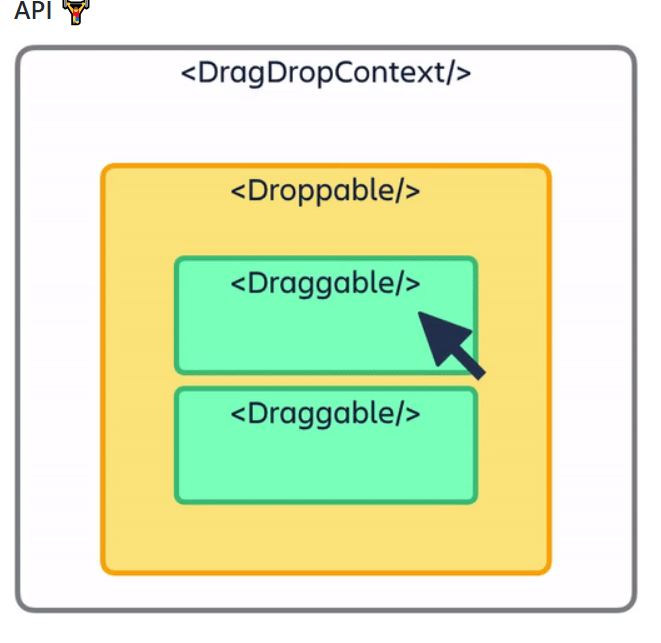

# react beautiful dnd
리액트에서 드래그 앤 드롭 기능을 만들기위해

react beautiful dnd라는 라이브러리가 사용된다.
[공식문서](https://github.com/atlassian/react-beautiful-dnd)

### 01. 설치 & import 
```
npm i react-beautiful-dnd

//타입스크립트
npm i --save-dev @types/react-beautiful-dnd
```

```tsx
//App.tsx
import { DragDropContext } from "react-beautiful-dnd";
```

### 02. Drag&Drop (DragDropContext)영역 설정



프로젝트의 모든부분이 드래그앤드롭기능을
필요로 하는것이 아니기에 그림과 같이

필요한 부분을 설정한다.
```tsx
//App.tsx
import { DragDropContext } from "react-beautiful-dnd";

function App() {
  const onDragEnd = () => {};
  return (
    <DragDropContext onDragEnd={onDragEnd}>
      <div></div>
    </DragDropContext>
  );
}
```
DragDropContext는 필수 prop으로 onDragEnd를 받는데,

onDragEnd는 유저가 드래그를 끝낸 시점에 실행될 함수이다.


또 DragDropContext는 children을 필요로 하는데
여기서 children는 DragDropContext 안쪽에 div나 span같은 태그를
넣어주면된다. 즉 비어있으면 안된다.

### 드래그앤드롭기능이 가능한 영역 = DragDropContext 
### 드롭할 수 있는 영역(그림의 노란부분) = Droppable
### 실제로 움직일수 있는 영역(그림의 초록부분) = Draggable

### 03. Droppable영역 설정

이제 그림의 노란색 부분을 설정하려한다.
Droppable로 설정이 가능한데,
Droppable또한 필수로 droppableId라는 prop을 받는다

droppableId는 drop가능한 부분이 여러곳일 수 있기때문에 어느부분인지 말해주는것

또 children도 받는데, DragDropContext와는 다르게
children으로 함수를 받는다(일반 ul태그를 쓰면 에러가난다)


```tsx
//App.tsx
import { DragDropContext, Droppable } from "react-beautiful-dnd";

function App() {
  const onDragEnd = () => {};
  return (
    <DragDropContext onDragEnd={onDragEnd}>
      <div>
        <Droppable droppableId="one">
         {()=><ul></ul>} 
        </Droppable>
      </div>
    </DragDropContext>
  );
}

export default App;
```

### 04. Draggable영역 설정

그러면 이제 정말 움직이는 item에 해당되는 Draggable을 만드는데, Droppable과 굉장히 비슷하다.

id를 받고, 함수로된 children을 받는다
그리고 추가로 index까지.

```tsx
//App.tsx
import { DragDropContext, Draggable, Droppable } from "react-beautiful-dnd";

function App() {
  const onDragEnd = () => {};
  return (
    <DragDropContext onDragEnd={onDragEnd}>
      <div>
        <Droppable droppableId="one">
          {() => (
            <ul>
              <Draggable draggableId="first" index={0}>
                {() => <li>One</li>}
              </Draggable>
              <Draggable draggableId="second" index={1}>
                {() => <li>Two</li>}
              </Draggable>
            </ul>
          )}
        </Droppable>
      </div>
    </DragDropContext>
  );
}

export default App;

```