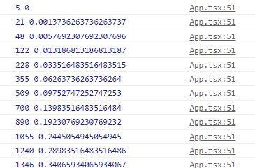

# FramerMotion2
내용이 너무많아서 2로 나눈 FramerMotion

## MotionValue(트래킹)
MotionValue는 내 애니메이션 내의 수치를 트래킹 할 때 사용한다.

예를 들어 유저가 오른쪽으로 드래그했는지, 왼쪽으로 드래그했는지 등.

```tsx
const Box = styled(motion.div)`
  width: 200px;
  height: 200px;
  background-color: white;
  border-radius: 40px;
  box-shadow: 0 2px 3px rgba(0, 0, 0, 0.1), 0 10px 20px rgba(0, 0, 0, 0.06);
`;

function App() {
  return (
    <Wrapper>
      <Box
        drag="x"
        dragSnapToOrigin
      />
    </Wrapper>
  );
}
```

이렇게 했을 때, 유저는 drag="x"에 따라 x축, 즉 가로로만
드래그가 가능하고, 드롭을 하는순간 제자리로 돌아간다.

예) 이 x를 트래킹하여, 오른쪽으로갔을 때는 배경색을 로,
왼쪽으로 갔을 때는 배경색을 색으로 바꿔보자.
```tsx
import { motion, useMotionValue } from "framer-motion";

function App() {
  const x = useMotionValue(0);
  return (
    <Wrapper>
      <Box
        style={{x}}
        drag="x"
        dragSnapToOrigin
      />
    </Wrapper>
  );
}

```

이렇게 작성하면, x를 트래킹하게되는데 
console.log(x)를 해도 x의값이 기본값0에서 바뀌지 않는다
=> 그이유는 motionValue는 state가 아니라,재랜더링 되지않기 때문이다.

따라서 바뀌는 x의값을 보려면 useEffect를 사용해야한다.
```tsx
function App() {
  const x = useMotionValue(0);
  useEffect(() => {
       x.onChange(()=>console.log(x.get()))
       }, [x]);
  return (
    <Wrapper>
      <Box style={{ x }} drag="x" dragSnapToOrigin />
    </Wrapper>
  );
}
```
x.get()의 값을 출력한다.

## useTransform 
useTransform에 useMotionValue로 받은 x를 넣어준다.

예제) 박스를 왼쪽으로옮기면(x값 약-600), 오른쪽으로 옮기면(x값 약600) (내브라우저기준)

x가 -600일때 => scale 2(크게)

x가 0일때 =>  scale 1(원사이즈)

x가 600일때 => scale 0만들기(작게)

```tsx
//사용법
function App() {
  const x = useMotionValue(0);
  const scale = useTransform(x,[-600, 0, 600], [2, 1, 0]);
  return (
    <Wrapper>
      <Box style={{ x, scale : scale }} drag="x" dragSnapToOrigin />
    </Wrapper>
  );
}
```
useTransform은 3가지 인자를 받는데, 첫번째는 useMotionValue로받아온값, 두번째는 내가 원하는 값(여러개니 배열로 3개라고알리기), 받을값(역시 여러개니 배열) 

그리고 이값과 style을 연결시킨다. 

   <Box style={{ x, scale : scale }} drag="x" dragSnapToOrigin />

## useTransform을 이용해 배경색도 바꿔보자.

1. 현재 배경색을 rgb값으로 바꿔준다.
```css
/* 변경전 */
background: linear-gradient(135deg, #e09, #d0e);

/* 변경후 */
  background: linear-gradient(135deg, rgb(238, 0, 153), rgb(221, 0, 238));

```
2. 배경색을 가지고있는 컴포넌트를 모션으로 바꿔주기
```tsx
//전
const Wrapper =styled.div``;

//후
const Wrapper = styled(motion.div)``;
```
아웃풋값에 똑같이 그라디언트 값3개를 넣어준다.
중요한건 Wrapper의 background가 바뀌는 것이기때문에
여기에 props을 넣어준다.


```tsx
function App() {
  const x = useMotionValue(0);
  const scale = useTransform(x, [-600, 0, 600], [2, 1, 0]);
  const gradient = useTransform(
    x,
    [-600, 0, 600],
    [
      "linear-gradient(135deg, rgb(147, 188, 246), rgb(65, 62, 250))",
      "linear-gradient(135deg, rgb(238, 0, 153), rgb(221, 0, 238))",
      "linear-gradient(135deg, rgb(239, 172, 251), rgb(66, 0, 71))",
    ]
  );
  return (
    <Wrapper style={{ background: gradient }}>
      <Box style={{ x, scale: scale }} drag="x" dragSnapToOrigin />
    </Wrapper>
  );
```

## 0.5 scroll
이 스크롤 기능을 하려면 value와 transform을 알아야한다.

먼저 useViewportScroll를 import한다.
```tsx
import { motion, useMotionValue, useTransform, useViewportScroll } from "framer-motion";
```

useViewportScroll은 scrollX/scrollY나 scrollYProgress값을 받는데, 이 둘의 차이를 살펴보자.

우리는 수직만 사용할것이기에 Y만 사용.
```tsx
const Wrapper = styled(motion.div)`
  width: 100vw;
  height: 500vh; //변화를 보기위해 길이 늘림
  display: flex;
  justify-content: center;
  align-items: center;
  background: linear-gradient(135deg, rgb(238, 0, 153), rgb(221, 0, 238));
`;
const { scrollY, scrollYProgress } = useViewportScroll();
  useEffect(()=>{
    scrollY.onChange(()=> console.log(scrollY.get(),scrollYProgress.get()))
  },[scrollY,scrollYProgress]);
```
onChange이벤트로 둘의 변화를 출력해본다.



scrollY은 픽셀값으로 현재위치를 주고, scrollYProgress는
0~1까지의 퍼센트로 현재위치를 출력한다.

```tsx
const Wrapper = styled(motion.div)`
  width: 100vw;
  height: 200vh;
  display: flex;
  justify-content: center;
  align-items: center;
  background: linear-gradient(135deg, rgb(238, 0, 153), rgb(221, 0, 238));
`;

function App() {
  const { scrollYProgress } = useViewportScroll();
  const scale = useTransform(scrollYProgress, [0,1], [1,5]);
  return (
    <Wrapper style={{ background: gradient }}>
      <Box style={{ x, scale:scale }} drag="x" dragSnapToOrigin />
    </Wrapper>
  );
}

```
useViewportScroll로 받아온값을,useTransform에 넣어주면
그 값의 변화에따라서 0일때 1, 1일때 5가된다.