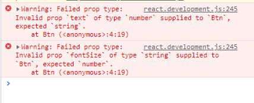

# propTypes 
props를 전달할 때 우리는 얼마든지 실수를 할 수 있다

 예를 들어 string 타입을 받아야하는데 number 타입을 적는 등

 다른 타입으로 잘못줬거나 꼭 필요한 값을 넣지 않을 경우.

 이렇게 실수했을 때 실수했다고 말해주는게 바로 propTypes이다.

## 사용법
먼저 설치와 import가 필요하다.
```js
//설치
npm i prop-types

// 사용할 js파일 상단에 import
import PropTypes from "prop-types";
```

- 예시

사용할 컴포넌트에 props가 어떠한 타입이 들어가는지 적어준다.

pops이름 : PropTypes.props타입.(필수여부)


 ```js
import PropTypes from 'prop-types';

const Greeting = ({userName, fontSize}) => { //props로 userName과 fontSize받기.
    return (
        <h1>Hello, {userName} </h1>  
    )
}

Greeting.propsTypes = {
    userName: PropTypes.string.isRequired,
    fontSize : PropTypes.number,
}

 ```
- isRequired

필수로 꼭 받아야하는 값이 있다면 userName처럼 마지막에 isRequired를 적어준다.


이렇게 propTypes을 지정하면 실수했을 때 console창에 에러로 알려준다.



- 배열/객체 지정하기

PropTypes으로 string이나 number같은 간단한 원시자료형은 기본 사용법으로
지정이 가능하나, 

배열이나 객체같은 참고자료형은 사용법이 달라진다.

array는 arrayOf를, object는 objectOf를 사용한다.
```js
Greeting.propsTypes = {
    userName: PropTypes.string.isRequired,
    fontSize : PropTypes.number,
    about : PropTypes.arrayOf()
}
```