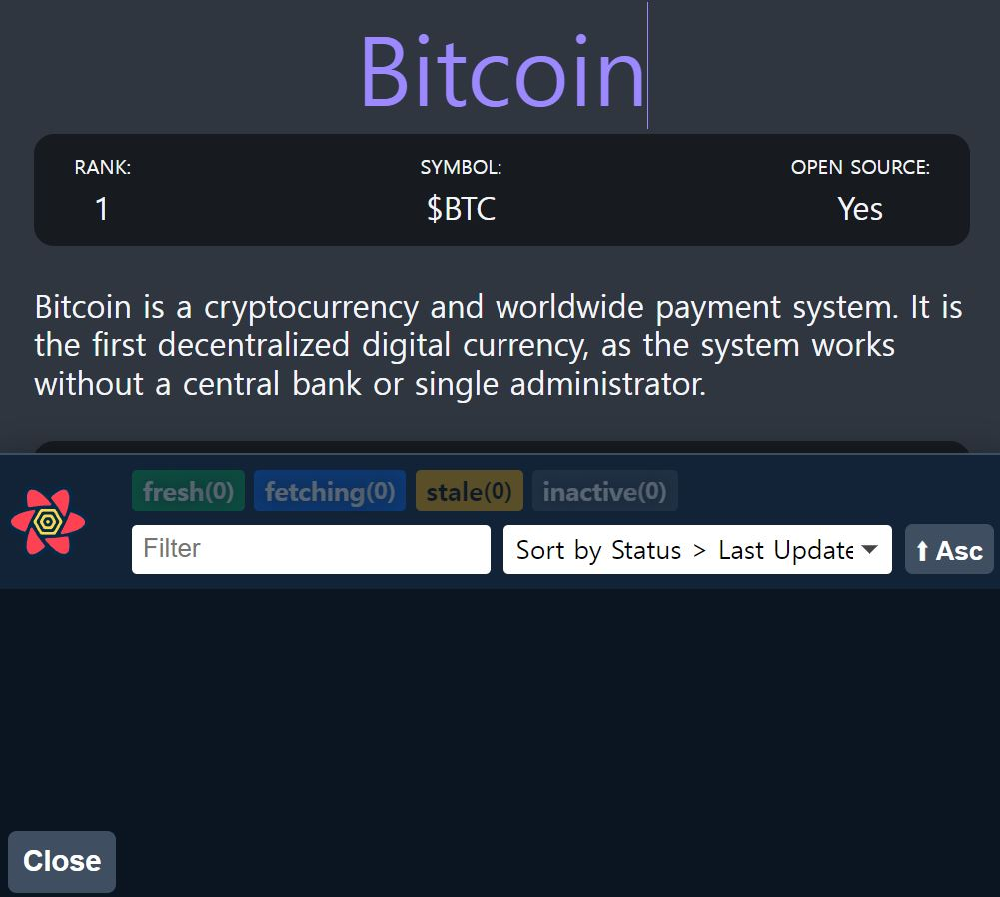

# React Query
내가 리액트를 공부하면서 정말 신세계라고 느꼈던 React Query.


## 01. React Query란?
[공식사이트](https://react-query.tanstack.com/)

리액트 쿼리의 설명을 찾아보면, 리액트앱에서 비동기 로직을 쉽게 다루게 해주는 라이브러리라고한다.

이게 무슨뜻이냐면

그동안 우리가 열심히 작성했던 
useState,useEffect,fetch,await,json등을 다 지워도된다.
그 과정을 단한줄의 코드로 리액트쿼리가 다해준다 또한 리액트쿼리는
한번받아온 api를 캐시로 저장하고있기때문에 동일한 내용을 또 받아오지 않는다.


## 02. React Query 사용전/후 비교
[사용전 기본코드]
```tsx
//Coins.tsx
//state부분

function Coins() {
  const [coins, setCoins] = useState<CoinI[]>([]);
  const [loading, setLoading] = useState(true);
  useEffect(() => {
    (async () => {
      const res = await fetch(`https://api.coinpaprika.com/v1/coins`);
      const json = await res.json();
      setCoins(json.slice(0, 100));
      setLoading(false);
    })();
  }, []);
  return (
      //생략
  ) };
```


## 03. 사용법

### 0.1 설치
```node
npm i react-query
```
### 0.2 queryClient, QueryClientProvider
공식문서의 quick start를 참고한다.

queryClient을 만들고, QueryClientProvider 사용하기

```tsx
//Index.tsx 
import { QueryClient, QueryClientProvider } from "react-query";

const queryClient = new QueryClient();

ReactDOM.render(
  <React.StrictMode>
    <QueryClientProvider client={queryClient}>
      <ThemeProvider theme={theme}>
        <App />
      </ThemeProvider>
    </QueryClientProvider>
  </React.StrictMode>,
  document.getElementById("root")
);
```
QueryClientProvider로 감싸주고, 이 QueryClientProvider는 props가 필요하기때문에 위에서
만든 queryClient를 넣어준다.

### 0.3 fetcher 함수만들기

설치와 셋팅이 끝났다면, 실제로 리액트 쿼리를 사용하기위해 첫번째로 fetcher 함수를 만들어야한다.

fetcher 함수란? useEffect안에서 사용한
api를 받아와 json으로 만드는 비동기 부분.

--------

### 여러개의 fetcher함수를 관리하기위해
### fetcher 함수들만 모은 api.ts 파일을 만들었다.

이 fetcher함수는 promise를 리턴해야한다.

```tsx
//api.tsx
export async function fetchCoins(){
    const res = await fetch(`https://api.coinpaprika.com/v1/coins`);
    const json = await res.json();
    return json;
}
//코드를 더 짧게 줄이면 promise형태로 작성
export function fetchCoins(){
    return fetch(`https://api.coinpaprika.com/v1/coins`)
    .then(res => res.json()
    );
}
```

### 0.4 불러와서 사용하기

useQuery로 불러올 수 있는데 useQuery는 2가지 인자를 받는다.

하나는 key, 두번째는 fetcher함수

```tsx
//Coins.tsx
import { useQuery } from "react-query";

 const { isLoading, data } = useQuery<CoinI[]>("allCoin", fetchCoins);
```
이렇게 작성하면, 처음에 loading이다가 fetcher함수
fetchCoins를 불러와 그 값을 data에 넣는다.

(타입스크립트가 data의 타입을 모르니, 이전에 작성한 CoinI 인터페이스를
넣어주었다.) 

react-query는 동일한 작업을 코드 1줄로 끝낼 수 있게해준다.

## 0.4 Devtools

react-query에있는 devtolls를 import를 하면,

캐시에 저장된 query를 볼 수 있다.
```tsx
//App.tsx
 import { ReactQueryDevtools } from 'react-query/devtools'

 function App() {
  return (
    <>
      <GlobalStyle />
      <Router />
      <ReactQueryDevtools initialIsOpen={true} />
    </>
  );
}
```
ReactQueryDevtools를 import하고, 가장아래부분에 랜더링해준다.  이렇게 하면, true로 설정했기때문에
페이지에 가자마자, Devtools를 볼 수 있다.



