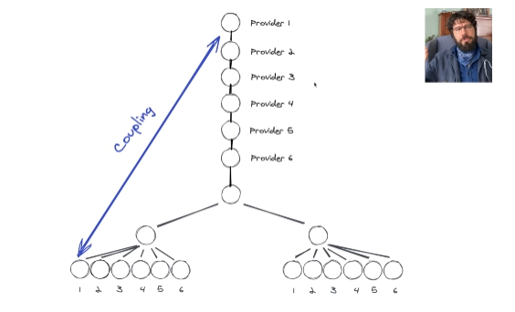

# Recoil 
Recoil 리코일은 페이스북에서 만든
리액트 상태관리 라이브러리이다.

[공식사이트](https://recoiljs.org/ko/)

### 왜 상태관리가 필요할까?


리코일 공식사이트에서 설명하듯이 리액트에서 state를 원하는 다른 컴포넌트로

이동시키기, 받기위해서  불필요하게 중간에 거쳐야하는
컴포넌트들이 생기게 된다. 그게 한 두개라면 해볼만하지만.. 

그림에서 보이듯이 가장 위에서 왼쪽 아래 1번까지 전달해야한다면? 그 이상의 갯수를 전달해야한다면?

과정도 복잡하고, 그 사이에있는 모든 컴포넌트들은 오로지 전달만을 위해
state를 받게되는 굉장히 비효율적인일이 발생한다.


이런 문제점을 해결하기 위해 Recoil이 나온것이고,

Recoil은 atom을 이용해 원하는 곳에서 한번에 state에 접근하게 해준다.

### 사용법

### 01. 설치
```node
npm install recoil
```

### 02. import와 RecoilRoot
나의 경우는 index.js에 RecoilRoot를 import하고
App을 감싸주었다.
```js
//index.js
import React from "react";
import App from "./App";
import { RecoilRoot } from "recoil";


ReactDOM.render(
  <React.StrictMode>
        <RecoilRoot>
        <App />
        </RecoilRoot>
  </React.StrictMode>,
  document.getElementById("root")
);

```

### 03. atom 만들기
state의 역할을 하는 atom을 만든다. 
아톰을 사용할 파일에 같이적어도 되지만, 따로 atom파일을 만들어도된다.

atom.ts파일 생성하고 atom을 import한다.

다크모드/라이트모드를 변환하는 atom을 만들예정
```ts
//atom.ts

import { atom } from "recoil";
export const isDarkAtom = atom({
    key: "isDark", //유일한 이름
    default : false, //초기값
})
```

아톰은 key(유일한값)와 초기값 이 두가지를 필요로 한다.

초기값이 false니 현재는 다크모드가아닌, 라이트모드이다.

### 04. 사용할 파일과 연결하기 = useRecoilValue
useRecoilValue를 사용하여, 연결한다. 

App.js와 isDarkAtom을 연결하고 싶다면?
값을 받아오는 useRecoilValue와 atom파일을 import.
```js
//App.js
import { useRecoilValue } from "recoil";
import { isDarkAtom } from "./atoms";

function App() {
  const isDark = useRecoilValue(isDarkAtom);
  return (
    <>
    <ThemeProvider theme={isDark ? darkTheme : lightTheme}>
      <GlobalStyle />
       <ToDoList />
       </ThemeProvider>
    </>
  );

```

useRecoilValue(사용할아톰)을 적어 값을 받아와서 사용하면 된다.

### 05. 가져온 value(값)를 수정해야한다면? = useSetRecoilState

useSetRecoilState 는 리액트 useState에서 setState와 동일한 역할을 한다.

위에서 만든 isDarkAtom을 버튼에 연결해,
클릭하면 다크모드 또 클릭하면 라이트모드가 되는 toggle버튼으로 만들어보자.

```js
const toggleFn = useSetRecoilState(isDarkAtom);
<button onClick={()=> toggleFn((prev) => !prev)}>toggle</button>
```
버튼을 클릭했을 때 발생하니, onClick이벤트를 써주고, 

현재값의 반대가 되는 값을 가져오도록 설정한다.

### 05. Selectors

recoil Selectors는 파생된 상태(derived state)의 일부를 나타낸다.. (공식문서 설명)

너무 어려우니 다른예로 찾아보자.

Selectors를 사용하면 어떤 state를 내가 원하는 형태의 다른 state로 변형할 수 있다.

예)
```tsx
//atoms.tsx
import React from 'react';
import { atom, selector } from 'recoil';

export interface IToDo {
    text : string;
    id: number;
    category: "TO_DO" | "DOING" | "DONE"; 
  }

export const toDoState = atom<IToDo[]>({
    key:"toDo", //key
    default: [], //기본값
 })

```
IToDo인터페이스에는 세가지 카테고리가 존재한다.

그 세가지를 각각의 아톰을 만들기보다는,
이미 만들어진 하나의 아톰에 selector을 이용해
다르게 변형시킬 수 있다. 

 [Selector 만들기]

키와, get함수가 필요하다.

위의 동일한 아톰파일에 selector내용만
추가한 상태.
```tsx
//atoms.tsx
import React from 'react';
import { atom, selector } from 'recoil';


export interface IToDo {
    text : string;
    id: number;
    category: "TO_DO" | "DOING" | "DONE"; 
  }

export const toDoState = atom<IToDo[]>({
    key:"toDo", //key
    default: [], //기본값
 })

export const toDoSelector = selector({
  key : "toDoSelector", 
  get : ({get}) => {
    return "hello";
  }
});
```

이렇게 만들어준다음, 사용할 파일에 가서
기본 state를 받을때사용되는 useRecoilValue를 이용해 받아온다.

```tsx
//todolist.tsx
import { toDoSelector } from "./atoms";

  const selectorOutput = useRecoilValue(toDoSelector)
  console.log(selectorOutput);

  //hello 출력
```

처음에 말한, 카테고리별로 아톰을 만들지않고,

결과값을 다르게 받아오는 것을 해보자.

```tsx
//atoms.tsx
export const toDoSelector = selector({
  key : "toDoSelector", 
  get : ({get}) => {
    const toDos = get(toDoState);
    return [toDos.filter((toDo) => toDo.category === "TO_DO")];
  }
});
 
```
### 0.6 get, set
get함수를 이용해 state를 받아오고,
그 state를 원하는 방식으로 출력하였다.


이렇게 원하는 방식으로 바꾼 state를 
수정하려면 set함수를 이용한다.

set 사용법은  useRecoilValue를 State로 바꾼다.
```tsx
//App.tsx
//수정 전
const hours = useRecoilValue(hourSelector);

//수정 후
const [ hours, setHours ] = useRecoilState(hourSelector);/
```
왜냐하면 useRecoilValue는 값만 주는 대신,
useRecoilState는 배열을 리턴하는데

그 배열의 첫번째인자는 값, 두번째인자는 값을 변경할수있는 함수를 주기때문

첫번째인자로는 hours = get함수로 설정한값
두번째인자는 변경함수

==즉 atom이나 selector로 useRecoilState를 쓰면,

- 배열의 첫번째는 atom의 값이거나, selector의 get함수의 값이된다.

- 두번째 인자는 atom을 수정하거나, selector의
set property를 실행시키는 함수이다.

set함수는 두개의 인자를 가지는데
첫번째인자는 수정하고싶은 state, 두번째인자는 새로운값.


+ 추가내용
나는 set함수가 너무어려워서 추가내용을 찾아보았다. 다른 설명을 보니

get함수는 정말 값을 찾는데 사용되고,

set함수를 사용하면 readonly에서 쓰기 가능한 상태로 바뀐다. 이게큰 차이점인것같다.


