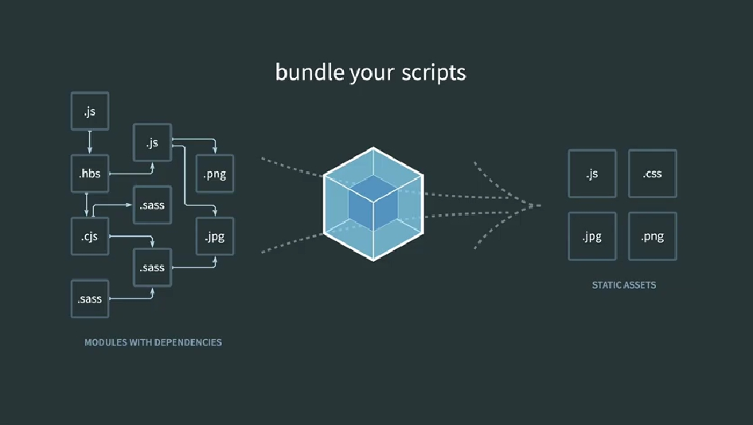

# Webpack 웹팩

## 01. Webpack이란?



개발을 하다보면, js파일부터 css파일, jpg이미지 파일 등

  많은 파일들이 필요한데, 이 파일들을 계속해서

서버로 받아온다면 어플리케이션이의 속도가 그만큼 느려지고, 

또 많은 파일을 사용하다보면, 동일한 이름의 변수나 함수명으로 인해 파일이 깨지기도 한다.

이런 문제를 해결하기위해 등장한게 여러개의 파일을 묶어주는 "번들러"다.

WebPack은 번들러 중의 하나이고 그 밖에도 Broserify, Parcel 등의 번들러가 있다.

## 02. 웹팩이 없다면?
예) 서로 다른 js파일에 동일한 변수명을 가지고 있을때,

index.html에서 두파일을 연결후 이 변수를 사용하려한다.
```html
<!-- index.html -->
<head>
 <script src="hello.js"></script>
 <script src="world.js"></script>
</head>
<body>
    <div id="root"></div>
    <script>
        document.querySelector('#root').innerHTML = word;
    </script>
</body>
```
```js
//hello.js
const word = 'hello';

//world.js
const word = 'world';
```
## 결과는 어떻게 나올까?

world가 작성된 파일이 아래쪽에 연결되어 있으므로 world만 나오게된다.

기존의 계획대로 hello world 두가지가 다나오게 하려면
import하는 방식을 써야하는 데 그방법은, 구형 브라우저에서는 지원하지않고, 여러개일때는 사용할 수 없는 방법이다. 

---------------------------------------------

## 03. 웹팩을 사용하면?

작성한 코드의 전체적인 모습을 유지하면서

구형/신형 브라우저에 관계없이 번들링을 도와준다

### 3.1 설치
npm init (package.json설치)후 설치
```node
$ npm install -D webpack webpack-cli
```
개발을 하기위한 기능은 -D옵션을 이용해 설치한다.

package.json에서 webpack과 webpack-cli이 추가된것을
확인할 수 있다.

### 3.2 사용
먼저 index.html에서 자바스크립트 코드를 별도의 js파일로 생성해준다.
```html
<script>
        document.querySelector('#root').innerHTML = word;
</script>
```
이 부분을 index.js라는 파일을 생성해 옮겨주었다.
```js
//index.js
document.querySelector('#root').innerHTML = word;
```

### 실행하기
먼저 실행후 출력될 폴더를 만든다(public)

```node
$ npx webpack --entry ./index.js --output-path ./public/index_bundle.js
```
이 코드를 해석하자면, webpack을 실행할때는 npx명령어로 실행하고,

엔트리파일, 내가 작업하는 프로젝트의 입구파일은 이것이다 알려주고,

아웃풋은 만들어놓은 엔트리파일에서 사용하는 모든 파일을

하나로 만들어 퍼블릭폴더에 index_bundle.js이름으로 출력해줘. 


<br>
이렇게 명령어를 입력하면 public폴더안에 index_bundle.js파일이 생기고,

```js
//public/index_bundle.js
(()=>{"use strict";document.querySelector("#root").innerHTML="hello world"})();
```
이파일을 index.html에 연결하면 원하던 hello world값을
한번에 얻을 수 있다.
```html
<!-- index.html -->
<body>
    <div id="root">
        <h1>hello</h1>
    </div>
    <script src="./public/index_bundle.js"></script>

</body>

```
출력결과


------------------------


생활코딩을 참고하여 작성하였습니다.