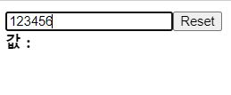
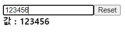
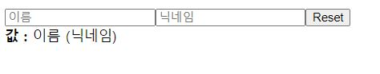
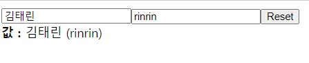

# input 상태 관리하기
예제) 인풋창에 입력하면, 값: 부분에 내가 입력한 값이 나오고,

리셋버튼을 누르면 전부 지워진다.

먼저 기본틀을 만든다.

```js
//InputSample1.js
function InputSample1(){
    return(
        <div>

        <input />
        <button>Reset</button>
        <div>
        <b>값 : </b>
        </div>

        </div>
    )
```
[현재상태]

값을 입력해도 아래 값부분에 출력되지않고, 버튼을 눌러도 아무이벤트가 없음.



입력한 값을 아래에 출력해보자.

1. 값(value)은 계속 바뀌니까 useState을 이용해 state 설정.

2. input에 입력한 값을 받아오기위해 값이 변화할때 마다 이벤트가 발생하는 onChange 사용
3. e.target.value으로 input의 value값 가져와 value로 만들어준다.  setValue(e.target.value);


```js
 function InputSample1(){
    const [value, setValue] = useState("");
    const onChange = (e) =>{
        setValue(e.target.value);
    };
    return(
        <div>

        <input onChange={onChange}/>
        <button>Reset</button>
        <div>
        <b>값 : {value}</b>
        </div>

        </div>
    )
}
 ```

[현재상태]

값은 출력이되지만, 리셋버튼은 작동하지 않음




<br />

이제 리셋버튼을 작동하게 만들어보자.

버튼에 클릭시 value값을 비워주는 이벤트를 연결하고 버튼을 눌러보면,

값 부분은 비워지는데 인풋창은 리셋이 되지않는다.

=> input의 value를 state와 연결한다.

```js
//InputSample1.js

function InputSample1(){
    const [value, setValue] = useState("");
    const onChange = (e) =>{
        setValue(e.target.value);
    };
    const onReset = () =>{
        setValue("");
    };
    return(
        <div>
        <input 
        onChange={onChange} 
        value={value}
        />
        <button onClick={onReset}>Reset</button>
        <div>
        <b>값 : </b>
        {value} 
        </div>
        </div>
    )
```

# 여러개의 input 상태 관리하기

인풋이 여러개일때 모두 state를 만들고, 모두 onChange를 만드는것은 비효율적이다.

=> input을 구분할 수 있도록 name을 주고, 객체로 관리한다.

인풋을 생성할때 name로 각각의 인풋을 구분시켜주었다.
```js
//InputSample2
function InputSample2(){
    return(
        <div>
        <input 
        name="name" 
        placeholder="이름" 
        value={name}
        />
        <input 
        name="nickname" 
        placeholder="닉네임" 
        value={nickname}
        />

        <button>Reset</button>
        <div>
        <b>값 : </b>
        이름 (닉네임)
        </div>
        </div>
    )
}
```
[현재상태]



이제 각각의 값을 state로 만들어줘야하는데, 값이 하나가 아니기때문에

객체로 초기값을 설정해준다.

```js
//state 설정
 const [inputs, setInputs] = useState({
        name : '',
        nickname : '',
    });
```
이제 인풋창에 입력할때마다 값을 업데이트 시켜줘야하는데

리액트에서 객체를 업데이트 시키는 방법은

1. 기존객체를 복사한다. (스프레드문법으로)
2. 값을 업데이트한다.

```js
  const { name, nickname } = inputs; //비구조할당
  //  비구조 할당으로 좀더 편리하게 작성.

    const onChange = (e) =>{
       const { name, value } = e.target;

    setInputs({
        ...inputs, //기존객체 복사
        [name] : value, //name을 대괄호안에담아 변수로 사용, name nickname 다 받을수있다
    })
    };
```
전체코드
```js
function InputSample2(){
    const [inputs, setInputs] = useState({
        name : '',
        nickname : '',
    });
    const { name, nickname } = inputs; //비구조할당

    const onChange = (e) =>{
       const { name, value } = e.target;

    setInputs({
        ...inputs, //복사
        [name] : value,
    })
    };
    const onReset = () =>{
        setInputs({
            name : '',
            nickname : '',
        });
    };
    return(
        <div>

        <input 
        name="name" 
        placeholder="이름" 
        onChange={onChange} 
        value={name}
        />
        <input 
        name="nickname" 
        placeholder="닉네임" 
        onChange={onChange} 
        value={nickname}
        />

        <button onClick={onReset}>Reset</button>
        <div>
        <b>값 : </b>
        {name} ({nickname})
        </div>
        </div>
    )
}

```
