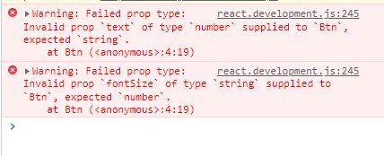

# props
props 컴포넌트 외부에서 받은 값

state에서 예를 들었던 예시로 다시 말하자면,

사람의 이름, 성별, 나이, 현재 사는 곳, 취업여부, 결혼/연애여부는 어디에 해당될까?

state - 현재 사는 곳, 취업여부, 결혼/연애여부

props - 사람의 이름, 성별, 나이

## 어떤 상황에 사용하는가?
data, 속성 등을 보낼 때 사용한다.

예) 동일한 스타일의 버튼이 이름만 달리 하고싶을때, 

버튼을 여러개 생성해 일일이 바꾸는 것이 아니라  

한번만 작성한 다음 버튼 이름을 넘겨주고, 받을 수 있다.

---------------------


## props 사용법
넘겨줄 데이터를 btn 컴포넌트에 작성 text="Save Changes"

props의 이름은 마음대로 작성가능. 여기선 text로 작성했기에
Btn에서 text로 받아온다.

Btn에서 console.log(text)하면, 이렇게 받아오는 것을 확인할 수 있다.

//출력

Save Changes

Continue

```js
//Btn 컴포넌트

function Btn({text}){ //text로 받기
       return(
           <button  style={{
               color : "white",
               backgroundColor : "tomato",
               padding : "10px 20px",
               border : 0,
               borderRadius : 10,
           }}>
           {text}
           </button>
       )
   }
//App 컴포넌트
   function App (){
        return (
        <div>
         <Btn text="Save Changes"/> //text로 넘겨주기
         <Btn text="Continue" /> //text로 넘겨주기
         </div>
         )}
    const root = document.querySelector("#root");
    ReactDOM.render(<App />, root);
```

## Memo
React에는 memorize(기억하기)기능이 있다.

이 기능은 props를 받아올 때 컴포넌트가 전체 re-rendering되는데,

전체를 다시받게되면 어플이 느려질 수 있기때문에, **state 변경이없는 것은 re-rendering하지않게 하는 기능이다.**

예시) Save Changes버튼 클릭시 Revert Change로 버튼명 변경됨/ Continue버튼은 계속 그대로

사용법 - MemorizedBtn = React.memo(Btn);만들어, Btn을 메모시키고,

Btn대신 MemorizedBtn 사용;

이렇게하면 변경되지 않는 Continue는 한번만 받아온다.

```js
  function Btn({text, changeValue}){ 
       return(
           <button 
           onClick={changeValue}
           style={{
               color : "white",
               backgroundColor : "tomato",
               padding : "10px 20px",
               border : 0,
               borderRadius : 10,

           }}>
           {text}
           </button>
       )
   }

    const MemorizedBtn = React.memo(Btn);
    function App (){
        const [value, setValue] = React.useState("Save Changes");
        const changeValue = () => setValue("Revert Change");
        return (
        <div>
         <MemorizedBtn text={value} changeValue={changeValue}/> 
         <MemorizedBtn text="Continue" />
         </div>
         )}
    const root = document.querySelector("#root");
    ReactDOM.render(<App />, root);

```

 **onClick={changeValue}를 html button에다 작성하면 이벤트리스너, 컴포넌트에 작성하면 props보내기**

## propTypes
 props를 전달할 때 우리는 실수를 할 수 있다

 예를 들어 버튼에 text는 string을 fontSize에는 number을 줘야하는데
 잘못줬을 경우.
 ```js
 //올바른 예
 <Btn text="Save Change" fontSize={18} />

 //잘못줬을 때
 <Btn text={18} fontSize="Save Change" />
 ```

이렇게 실수했을 때 실수했다고 말해주는게 바로 propTypes

propTypes를 설치하고 사용할 컴포넌트에 prop가 어떠한 타입이 들어가는지 적어준다.

fontSize처럼 마지막에 isRequired를 적어주면 꼭 입력해야하는 값으로 표시할 수 있다.
```js
  Btn.propTypes = {
       text: PropTypes.string,
       fontSize : PropTypes.number.isRequired, 
   };
```
이렇게 propTypes을 지정하면 실수했을 때 console창에 에러로 알려준다.


