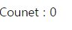

# state
state란 컴포넌트 내부에서 변할 수 있는 값

좀더 잘 이해하기 위해 사람을 예시로 들면

사람의 이름, 성별, 나이, 현재 사는 곳, 취업여부, 결혼/연애여부는 어디에 해당될까?

state - 현재 사는 곳, 취업여부, 결혼/연애여부

이 값들은 이사를 가거나, 취업을 하거나, 회사를 그만두거나 등 충분히 바뀔 수 있다. >> state

하지만 이름(개명제외), 성별, 나이는 내마음대로 바꿀 수 있는 것이 아니다.

## 1. 어떤 상황에 사용하는가?
값이 바뀌는 state. 값이 변하면 리랜더링이 필요한데.

값이 바뀔 때 마다 수동으로 랜더링 할 수 없으니, useState를 사용한다. 


## 2. useState

### 2.1 셋팅

useState를 사용하려면, js상단에 모듈을 끌어와준다.

따로 설치할 필요x 
```js
//App.js
import React, {useState}  from "react";
```

### 2.2 useState 문법
```js
const data = React.useState();
console.log(data);
 ```

변수를 하나만들어, useState를 할당하고 출력해보면 [undefined, f] 라는 배열이 출력된다.

배열[0]의 값 undefined는 data의 초기값을 나타내고,

 배열[1]의 값 f은 그 초기값을 바꿀수 있는 함수이다.

이 값들을 불러와서 이용할 건데, 일일이 변수에 담아사용하긴 불편함으로 구조분해할당을 한다.


### 2.3 useState 사용법

예제) 카운터 - add 버튼을 클릭할 때마다 1씩 숫자가 더해진다.

먼저 틀을 만들어 주었다.
```js
//App.js
function App() {
      const onClick = () => {
   
  }
  return (
    <div>
    Counet : 0
    <button onClick={onClick}>Add</button>
  </div>
  )
}
```
화면에 렌더링되는 모습



이 부분에서 숫자0 부분이 계속 바뀌는부분 = state이다.

이 부분을 수정해보자. 

이 state에 이름을 준다(value)

이 state를 바꾸는 함수의 이름을 준다(setValue)

그리고 초기값을 0으로 설정 => 0대신 {value} 작성.

```js
//[값, 값을 변경시키는 함수] = React.useState(초기값); 
 const [value, setValue] = React.useState(0);
```

그리고 아직 버튼을 누르면 실행되는 이벤트 onClick이 비어있는데

이부분을 setValue(실행할코드) 이렇게 작성하면된다.
```js
//버튼을 클릭하면, 현재 value값에 +1를 하겠다.
  const onClick = () => {
    setValue((pre)=> pre + 1);
  }
```

전체코드
```js
//App.js
function App() {
  const [value, setValue] = useState(0);
  const onClick = () => {
  setValue((pre)=> pre + 1);
  }
  return (
    <div>
    Counet : {value} 
    <button onClick={onClick}>Add</button>
  </div>
  )
}
```

[작동하는 모습]


