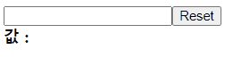

# useRef_DOM선택하기
## 1. useRef란?

자바스크립트에서 Document.querySelector나 getelementId등으로 

DOM을 선택하는 경우가 있었는데,

리액트에서도 가끔씩 DOM을 직접 선택하는 경우가 있다.

그럴때 useRef를 사용한다.

## 2. useRef로 DOM제어하기

예제) reset 버튼을 클릭하고나면, focus가 버튼에 있는 상태이다.

이 focus를 input으로 옮겨보자.

```js
//기본코드
function InputSample1(){
    const [value, setValue] = useState("");
    const onChange = (e) =>{
        setValue(e.target.value);
    };
    const onReset = () =>{
        setValue("");
    };
    return(
        <div>
        <input onChange={onChange}/>
        <button onClick={onReset}>Reset</button>
        <div>
        <b>값 : {value}</b>
        </div>

        </div>
    )
}
```


1. js상단에 useRef를 불러온다.
2. 변수를 하나만들어 useRef()를 할당하면, 객체가 만들어진다
```
    const valueInput = useRef(); //객체 생성
```
3. 이 객체를 값을 가져오고싶은 input에 ref로 넣는다.
4. valueInput.current.focus();로 사용.

   (current가 현재가르키고있는 input을 말한다.)

   

## 3. useRef로 컴포넌트안에 변수만들기

useRef로 변수를 만드는 경우 :

일반적으로 사용하는 let이나 const로 변수를 만들게되면, 컴포넌트를 다시렌더링하면

값이 초기화 되어버린다.

또 useState를 사용해서 state로 만들면, 계속 자동렌더링 되는것이니..

<br />

값은 바꾸나 리랜더링이 필요없을때, 값을 기억해야할 때 useRef를 사용한다.
### ※ useRef로 변수를 만들면, 리랜더링되지 않는다.
```js
 const users =[
    {
        id :1,
        username: 'rin',
        email: '12345.rin@gmail.com'
    },
    {
        id :2,
        username: 'jane',
        email: 'jane075@naver.com'
    },
    {
        id :3,
        username: 'tester',
        email: 'tester@daum.net'
    }
];
```

user의 id, name, email이 담긴 이러한 배열이 있을때, 

배열의 항목이 추가되어 id가 4,5.. 추가되어도

리랜더링 될필요는 없다. 그래서 변수를 하나만들어 초기값을 4로 주고, 

onCreate함수가 실행될때, 현재값에서 +1를 한다.

```js
function App() {
  const users =[
    {
        id :1,
        username: 'rin',
        email: '12345.rin@gmail.com'
    },
    {
        id :2,
        username: 'jane',
        email: 'jane075@naver.com'
    },
    {
        id :3,
        username: 'tester',
        email: 'tester@daum.net'
    }
];
const nextId = useRef(4);

const onCreate = () => {
  nextId.current += 1;
}

  return (
    <div>
   <UserList users={ users }/>
  </div>
  )
}

```