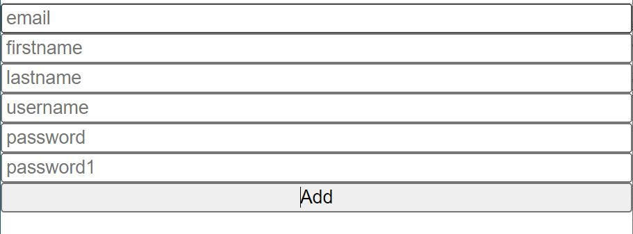

# 유효성검사 react-hook-form

유효성검사라면, 주로 회원가입을 할 때 볼 수있다.

이름, 아이디, 비밀번호, 비밀번호 확인 등 여러개의 인풋창에 유저가 정보를 입력하게 되는데 이때 이 정보가, 적당한지 검사를 하는 것이다.

예를 들어, 이메일 형식이 올바른지, 혹은 특정 이메일만 사용할 수 있는데 그 특정이메일에
해당되는지, 비밀번호의 최소 길이 이상인지 등을 확인한다.

일반 자바스크립트에서는 조건문 등을 이용해
일일이 검사해야했다면, 리액트에서는
react-hook-form을 사용하면 굉장히 편리하게
유효성 검사를 진행할 수 있다.

## 설치
react-hook-form 공식홈페이지 참고
```node
npm install react-hook-form
````
설치 후 js파일에 import하기

```js
//사용할 js파일
import React from "react";
import { useForm } from "react-hook-form";
```

## 기본예제
이메일, firstname, lastname, username, 비밀번호, 비밀번호확인 총 6개의 인풋창에 유효성 검사를 해보자.

```tsx
//Inputs.tsx
import React, { useState } from "react";
import { useForm } from "react-hook-form";

function Inputs() {
  return (
    <div>
      <form  style={{ display: "flex", flexDirection: "column" }}>
        <input required placeholder="email" />
        <input required placeholder="firstname"/>
        <input required placeholder="lastname"/>
        <input required placeholder="username"/>
        <input required placeholder="password"/>
        <input required placeholder="password1"/>
        <button>Add</button>
      </form>
    </div>
  );
}
```
에러메세지를 쉽게확인할 수있도록 스타일 값을 주고, 모든 인풋창을 값을 필수로 넣어야하는 
required 상태이다.

[ 현재상태 ]

