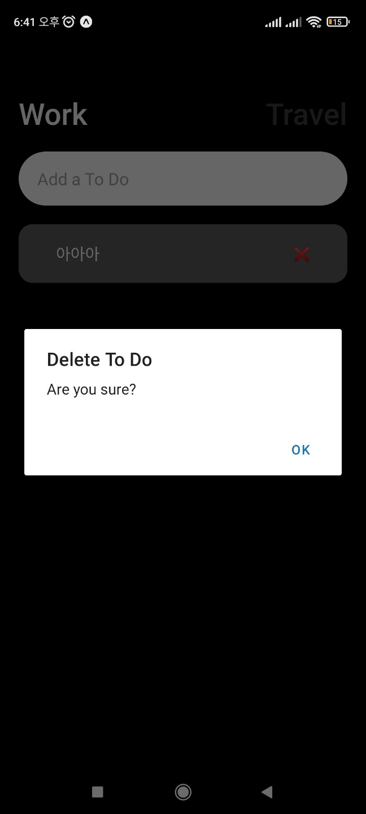

# Alert
Alert API는 팝업창을 실행시킨다.

alert()과 prompt() 이 두가지가 있는데,
prompt는 ios에서만 동작한다.

## 0.1 사용하기

x 버튼을 눌러 삭제하려할때, 유저에게
정말로 삭제할것인지 물어보기.

```js
//문법
Alert.alert("대제목", "소제목")
```
```js
const deleteToDo = async(key) => {
  Alert.alert("Delete To Do", "Are you sure?")
  return
   const newToDos = {...toDos}//복사
   delete newToDos[key]
   setToDos(newToDos);
   await saveToDos(newToDos);
};
```
[ 내폰으로 확인한 모습 ]



## 0.2 취소버튼 만들기

현재는 팝업창에 ok또는 확인버튼만 나온다.

여기에 취소버튼이 생기게 만들어보자.

공식문서

https://reactnative.dev/docs/alert


공식문서를 확인하면, buttons을 사용할 수 있다고 나온다.

이 버튼을 클릭해보면 사용법이 나오는데,
버튼은 array고, text와 onPress를 사용할 수 있다.

text는 버튼에 보일 내용을 뜻하고,

onPress는 버튼을 눌렀을때 실행될 함수이다.

```js
const deleteToDo = async(key) => {
  Alert.alert("Delete To Do",
   "Are you sure?",[
   {text : "Cancle" },
   {text : "I'm Sure" },
   ]);

```
alert뒤쪽으로 배열을 열고, text를 넣어준다.


## 0.3 onPress로 삭제 함수연결

그리고  "I'm Sure"버튼을 클릭했을때 onPress를 넣어,

지우는 함수를 적어주자.
```js
const deleteToDo = async(key) => {
  Alert.alert("Delete To Do",
   "Are you sure?",[
   {text : "Cancle" },
   {text : "I'm Sure", onPress: () => {
    const newToDos = {...toDos}//복사
    delete newToDos[key]
    setToDos(newToDos);
   saveToDos(newToDos);
   }},
   ]);
};
```
## 0.4 style
ios에서만 사용할 수 있는 style.

  style:"destructive"
  
  이 한줄만 추가해주면, 하나의 버튼색깔은 다른색(빨간색)으로 보인다.

  내폰은 안드로이드라 확인이 안된다 ㅠㅠ
```js
const deleteToDo = async(key) => {
  Alert.alert("Delete To Do",
   "Are you sure?",[
   {text : "Cancle" },
   {text : "I'm Sure",
   style:"destructive",
   onPress: () => {
    const newToDos = {...toDos}//복사
    delete newToDos[key]
    setToDos(newToDos);
   saveToDos(newToDos);
   }},
   ]);
};
```
