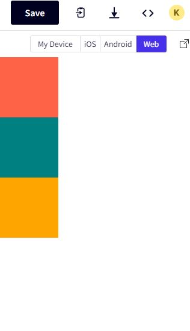

# Layout

React Native에서 레이아웃을 만들려면 Flexbox를 사용해야한다.

React Native는 display block도없고,
inline-block도 없고, grid도 없다.

Flexbox만 하면된다.

## 0.1 기초셋팅

App.js를 다지우고 이렇게 만들어놓자.

```js
//App.js
import React from "react";
import { View } from "react-native";

export default function App() {
  return (
    <View>
      <View></View>
      <View></View>
      <View></View>
    </View>
  );
}
```

## 0.2 스타일로 각각 컬러주기

```js
//App.js
import React from "react";
import { View } from "react-native";

export default function App() {
  return (
    <View style={{ flexDirection : "row"}}>
      <View
        style={{ width: 200, height: 200, backgroundColor: "tomato" }}
      ></View>
      <View style={{ width: 200, height: 200, backgroundColor: "teal" }}></View>
      <View
        style={{ width: 200, height: 200, backgroundColor: "orange" }}
      ></View>
    </View>
  );
}
```

[현재모습]



박스가 현재 세로로 쌓여있는데 가로로만들기위해

가장 바깥쪽 view에 스타일을 주자.
```js
  <View style={{ flexDirection : "row"}}>
```

여기서 웹과의 차이점은

display: flex를 한다음에 flexDirection를 주는게아니라, 바로 주면된다는것

default값이 flex이기 때문이다.

또 다른 차이점은 웹에서는 기본값이 가로 "row"이지만,

모바일에선 세로 "column"이다.

## 0.3 반응형으로 생각하기.

지금은 width, height로 딱 지정되어있지만,
이건 어떤 스크린으로 보느냐에따라서 다 다르게 보인다.

모든 디바이스에서 동일하게 보여야하므로 width,height를 사용하지 않는다.

=> 숫자만 생각한다.

기본으로 flex상태이기때문에, flex는 size를 받는다.

```js
//App.js
export default function App() {
  return (
    <View style={{flex:1}}>
      <View style={{flex:1, backgroundColor:"tomato"}}></View>
      <View style={{flex:1, backgroundColor:"teal"}}></View>
      <View style={{flex:1, backgroundColor:"orange"}}></View>
    </View>
  );
}
```
이렇게 작성하면 무슨뜻일까?

부모의 크기에 꽉차게 안쪽의 뷰 컴포넌트 3개가 1:1:1 비율을 갖는다는것

※ 부모에 flex size를 꼭줘야한다. 기준이 되는 값이기 때문.