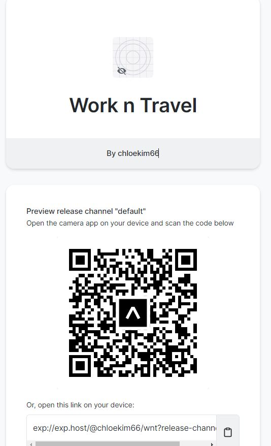

# Publish
Publish하는 방법은 http url에 접속시 보이는

Publish or republish project...

이 메뉴를 클릭하면 된다.

그럼 내 자바스크립트 코드가 expo 웹사이트로 보내지고,

다른 사람들과 공유할 수 있게된다.

## 0.1 Publish 버튼을 눌러보자

어플의 이름과 url뒤에 붙게될 주소를 물어보고,

작성하면 끝!

https://expo.dev/@chloekim66/wnt

## 0.2 주소 들어가보기

브라우저에 https://expo.dev/@chloekim66/wnt를

입력하면 이런 화면을 볼 수 있다.

여기보이는 QR을 스캔하면 다른사람이 내 앱을 볼수있다. 

