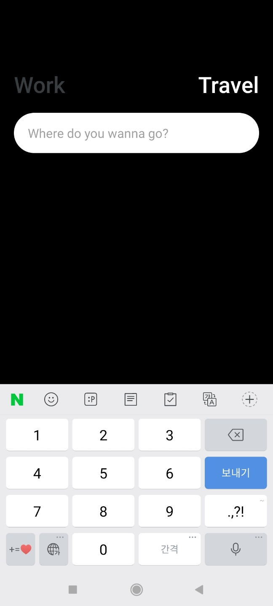

# TextInput
공식문서 https://reactnative.dev/docs/textinput

native는 브라우저가 아니기때문에 html의 input태그를 
사용할 수 가없다.

TextInput이라는 것을 사용해줘야한다.

## 0.1 import
TextInput을 import해준다.

```js
//App.js
import { StyleSheet, Text, View,TouchableOpacity,TextInput } from "react-native";
```
## 0.2 스타일주기

```js
//App.js
//생략

        <TextInput style={styles.input} />


```
```css
   input: {
    backgroundColor: "white",
  },
```

원하는 부분에 작성하면되는데 아무것도 안보이기때문에 스타일로 background컬러를 줘보자.

--------------

공식문서의 오른쪽을 보면 사용할 수 있는 props의 종류가 굉장히 많다.


## 0.3 keyboardType 
keyboardType은 유저가 이메일이나 전화번호를 입력할 경우 키보드의 타입을 변경시켜준다.

number-pad /
decimal-pad /
numeric /
email-address /
phone-pad /
url등을 사용할 수 있다.

```js
<TextInput 
        keyboardType="number-pad"
        placeholder={working ? "Add a To Do" : "Where do you wanna go?"} style={styles.input} />
```

number-pad를 작성하면, 숫자만 입력할수있는 키보드가 나오고, email-address로 작성하면 이메일 작성에필요한 @ 엣 기호있는 키보드가 나온다.

## 0.4 returnKeyType 완료버튼바꾸기
또 많이 쓰이는것이 있는데, 이props는 안드로이드에서만 작동한다.

returnKeyType은 말그대로, input에 텍스트를 작성하고,

누르게 되는 버튼의 이름을 바꿀수있다.

done /
go /
next /
search /
send /

```js
 <TextInput 
        returnKeyType="send"
        keyboardType="number-pad"
        placeholder={working ? "Add a To Do" : "Where do you wanna go?"} style={styles.input} />
```



send로 설정하니
파란색버튼이 원래 완료였는데 보내기로 바뀌었다.

## 0.5 비밀번호 작성시

일반 input에 password속성시 입력한 텍스트가 숨겨지는것처럼 native에서도 secureTextEntry를 사용하면
동일한 효과를 줄 수 있다.

## 0.6 여러 줄 작성하기
multiline이라는 속성을 작성하면, input안의 내용이 길어졌을 때 여러줄로 작성이 가능하다.

multiline을 사용하지않으면, 아무리 내용이 길어져도

한줄로만 써진다.

## 0.7 onChangeText 작성한 텍스트받기

onChange이벤트처럼 유저가 input에 작성한 텍스트를 받아올 수 있다.

event를 받아 event를 출력하는 함수를 만들고,

onChangeText로 input에 연결해준다.

```js
  const onChangeText = (e) => console.log(e);

  return(
          <TextInput 
        onChangeText={onChangeText}
        placeholder={working ? "Add a To Do" : "Where do you wanna go?"} style={styles.input} />
  )
```
출력되는걸 확인했으면 저장해보자.

저장이 될 state를 만들고,

input에 value를 text로 설정, onChange가 감지되면 setText에 저장한다.
```js
 const [ text, setText ] = useState("");
 const onChangeText = (e) => setText(e);
 return(
         <TextInput
        value={text} 
        onChangeText={onChangeText}
        placeholder={working ? "Add a To Do" : "Where do you wanna go?"} style={styles.input} />
 )

```
이제 유저가 완료또는 보내기 버튼을 누르면 alert이 뜨게만들어보자.

먼저 보내기(submit)감지 => onSubmitEditing

버튼클릭시 작동될 함수만들어 연결

```js
//작동될 함수
  const addToDo = () => {
    alert(text);
  }
//연결하기
  <TextInput
        onSubmitEditing={addToDo}
        value={text} 
        onChangeText={onChangeText}
        placeholder={working ? "Add a To Do" : "Where do you wanna go?"} style={styles.input} />
```

## 0.8 문자 자동수정 활성/비활성

주로 문자를 잘못쳤을때 키보드가 올바른단어로 자동수정을 하는경우가
있는데 이를 비활성화 시킬 수 있다.

바로 autoCorrect를 불린값으로 조절하면 된다.

