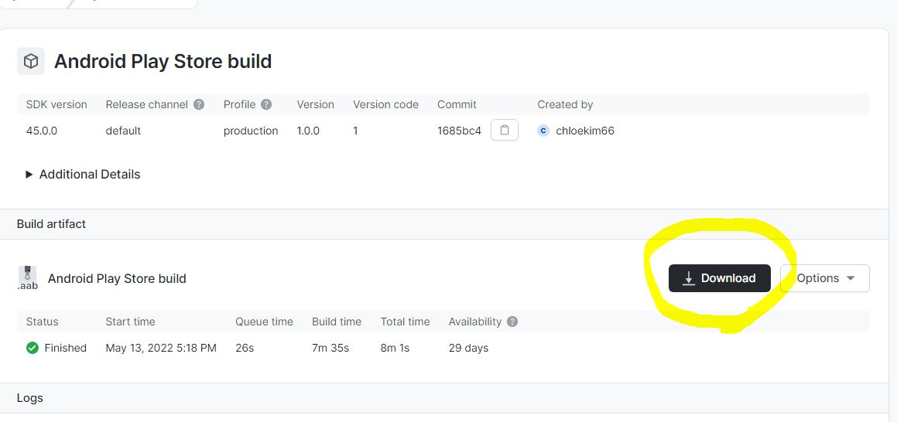

# 앱스토어에 올리기

## 0.1 icon 바꾸기
assets 폴더안에 필요한 모든게 들어있다.

splash screen.png이라는 사진 파일이 있는데, 이 파일은 어플리케이션이 로드될때마다 보이는 screen이다.

favicon(즐겨찾기 아이콘)은 웹에서 보이는 것이고,

adaptive-icon은 안드로이드를 위한것이다.

그리고 바로 icon.png가 현재 보이는 이 앱의 아이콘이다.

이 부분을 원하는 아이콘을 assets 폴더에넣고 icon이름으로 저장해준다.


## 0.2 app.json
app.json파일은 
내가 원하는 대로 편집할 수 있는 파일이다

app.json에서 설정할 수 있는 사항들은 굉장히 많다.

name,slug,splash에서 부터,

페이스북으로 로그인하기, 태블릿으로만 보게하기 등등

우리는 방금 icon을 바꿨으니, 해당 icon에 맞게 배경색깔을 바꿔주자.


## 0.3 Expo-cli로 build 

그럼 이제 앱스토어에 올려보자

사실 deploy하는 과정은 굉장히 번거롭다.

실제 앱스토어에 올리려면 $99를 내야하고, 안드로이드는 $25..

스크린샷을 찍어 설명해야한다.
하지만 Expo-Cli를 사용한다면?

Expo-Cli가 알아서 bulid를 해준다.

```node
<!-- 안드로이드용 -->
expo build:android

<!-- ios용 -->
expo build:ios
```
이 명령어를 치니..
23년 4월까지 사용할 수 없다고, 대체 명령어가 나왔다.

```node
<!-- 설치 -->
npm install -g eas-cli

<!-- 입력 -->
eas build -p android
eas build -p ios
```

명령어를 입력하니, 내 어플의 id를 묻는다.
원하는 id를 입력 후 엔터 엔터..

무료버전을 이용하기때문에 build하는데 시간이 꽤걸린다.


## 0.4 게시하기
공식문서를 그대로 참고해서 올리면된다.

git init을 하고, 내 url로 origin을 설정해준다음,

gh-pages를 다운받는다.

```node
git init
git remote add origin <YOUR_GITHUB_PAGES_URL>
npm install -D gh-pages
```

설치 후 package.json에 script를 추가한다.
```json
//package.json
 "deploy" : "gh-pages -d web-build",
  "predeploy" : "expo build:web"
```

저장 후

```node
npm run deploy
```


## 0.5 확인하기
https://expo.dev 사이트에 로그인해서

builds를 확인해보면, 방금 올린 어플리케이션이 보인다.

클릭하여, 다운로드한다.




이 파일을 돈내고..앱스토어에 보내면된다.


## 0.6 Expo의 문제점

 1. 많은 앱 설정을 할 수 없다.
 ㄴ 근본적인 파일에는 접근할 수 없기 때문에. 오직 app.json에 있는것만 설정가능

2. 용량이 무지 크다.
ㄴ expo안에 안쓰지만 담고있는것들이 이미 많아, 용량이 엄청나게 크다. 그리고 이 용량을 줄일 수 없다.


