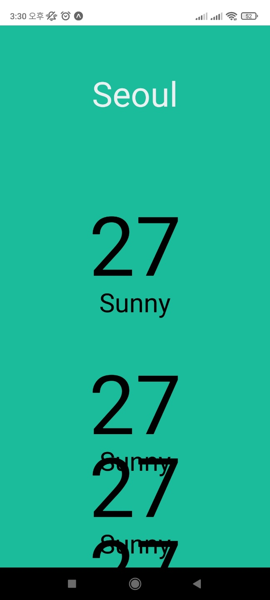

# scrollView
컴퓨터 브라우저에서는 내용이 길어질때 자동으로 스크롤이 생긴다.

하지만 모바일에서는 자동으로 생기지않고, 내려가지도 않는다.

그래서 이럴때 사용하는게 scrollView이다.

[ 현재상태 ]

여러날의 날씨를 가져왔는데 스크롤이 내려가지 않아, 겹쳐있다.



## 0.1 사용법

가장 바깥의 View를 scrollView로 바꿔준다.

```js
//App.js
import { View, StyleSheet, Text, ScrollView } from "react-native";

export default function App() {
  return (
    <View style={style.container}>
      <View style={style.city}>
        <Text style={style.cityName}>Seoul</Text>
      </View>
      <ScrollView style={style.weather}>
        <View style={style.day}>
          <Text style={style.temp}>27</Text>
          <Text style={style.description}>Sunny</Text>
          </View>
          <View style={style.day}>
            <Text style={style.temp}>27</Text>
            <Text style={style.description}>Sunny</Text>
            </View>
          <View style={style.day}>
            <Text style={style.temp}>27</Text>
            <Text style={style.description}>Sunny</Text>
            </View>
          <View style={style.day}>
            <Text style={style.temp}>27</Text>
            <Text style={style.description}>Sunny</Text>
          </View>
      </ScrollView>
    </View>
  );
}
```
이제 폰으로 확인하면 스크롤이 내려가는것이 확인된다.

## 0.2 커스터마이징

굉장히많은 prop가 존재하는데 원하는걸로 디자인하면된다.

https://reactnative.dev/docs/scrollview#horizontal

```js
//App.js
//생략

 <ScrollView horizontal style={style.weather}>

```
ScollView옆에 horizontal를 넣어주니 가로로
스크롤이 움직인다.

하지만, 중요한건 flex : 3 이라고 지정한 레이아웃의 크기가 없어졌다. 왜냐하면 스타일 prop을 사용했기때문에,

이미 스타일을 사용중이라면 contentContainerStyle을 사용해야한다.

https://reactnative.dev/docs/scrollview#contentcontainerstyle

1. contentContainerStyle로 바꿔준다.

```js
//App.js

   <ScrollView horizontal contentContainerStyle={style.weather}>
```

2. (weather의)flex를 지워준다. 당연히 스크린보다 더커야하기때문

# 브라우저의 크기받아오기
Dimensions API를 사용하여, 유저가 어떤화면에서 보는지,

그 화면의 크기를 받아온다.

1. import하기 
```js
//App.js
import { Dimensions } from "react-native";
```
2. 문서의 사용법 확인하기

공식문서의 사용법
```js
const windowWidth = Dimensions.get('window').width;
const windowHeight = Dimensions.get('window').height;

//두가지를 한번에 받으려면
const { height , width } = Dimensions.get('window');
```

그리고 console.log로 출력하면 터미널에 크기가 나온다.

우린지금 가로 스크롤중이라 width만 필요하다.

```js
//App.js
const { width } = Dimensions.get('window');
console.log(width);

//터미널창 출력
//392.7272

```

이 width에 이름을 주고, 
```js
//App.js
const { width:SCREEN_WIDTH } = Dimensions.get('window');

//day의 width값을 저 변수로 준다.
const style = StyleSheet.create({
  day: {//하나의 day가 전체화면이 되야함
    width: SCREEN_WIDTH,
    alignItems: "center",
  },
  });
```

3. pagingEnabled 추가해주기
지금은 한번 스크롤하면 스르륵 몇개가 넘어가니까,
한번에 하나씩 페이지를 생성해 넘어가도록

ScrollView에 pagingEnabled prop을 추가해준다.
```js
//App.js
  <ScrollView 
  pagingEnabled
  horizontal
  contentContainerStyle={style.weather}>
  ```

  4. 페이지 표시 칸 숨기기
  showsHorizontalScrollIndicator 으로
  아래 막대바를 숨기자.

  ```js
  //App.js
      <ScrollView
        pagingEnabled
        horizontal
        showsHorizontalScrollIndicator={false}
        contentContainerStyle={style.weather}
      >  
  ```