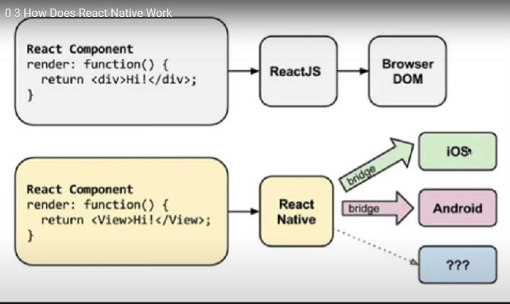

#  How Does React Native Work 
리액트 네이티브를 사용하면, 어떤 방식으로 작업이 진행되는지 알아보자.

리액트js로 웹사이트를 만들때는

html이 만들어지고, React.js로 간다음

브라우저가 javaScript를 실행시켜준다.

//출처 노마드코더 

반면에, React Native에는 브라우저가 없다!

인터페이스로, 우리의 운영체제(ios나 안드로이드)사이에 있는것이다.

예를 들어) 우리가 버튼을 만들면, 리액트 네이티브가

ios 버튼을 만들어달라고하고, 안드로이드에 버튼을 만들어달라한다.

그럼 ios는 ios만의 버튼을 만들것이고, 안드로이드는 안드로이드의 버튼을 만들게 된다. 그래서 모습이 다르다.

=> 중요한건 React Native가 직접 버튼을 만들지 않는다는것.

그래서 이 모든 인프라들을 사용하라면, java와 xcode를 설치해야한다는 것이다.